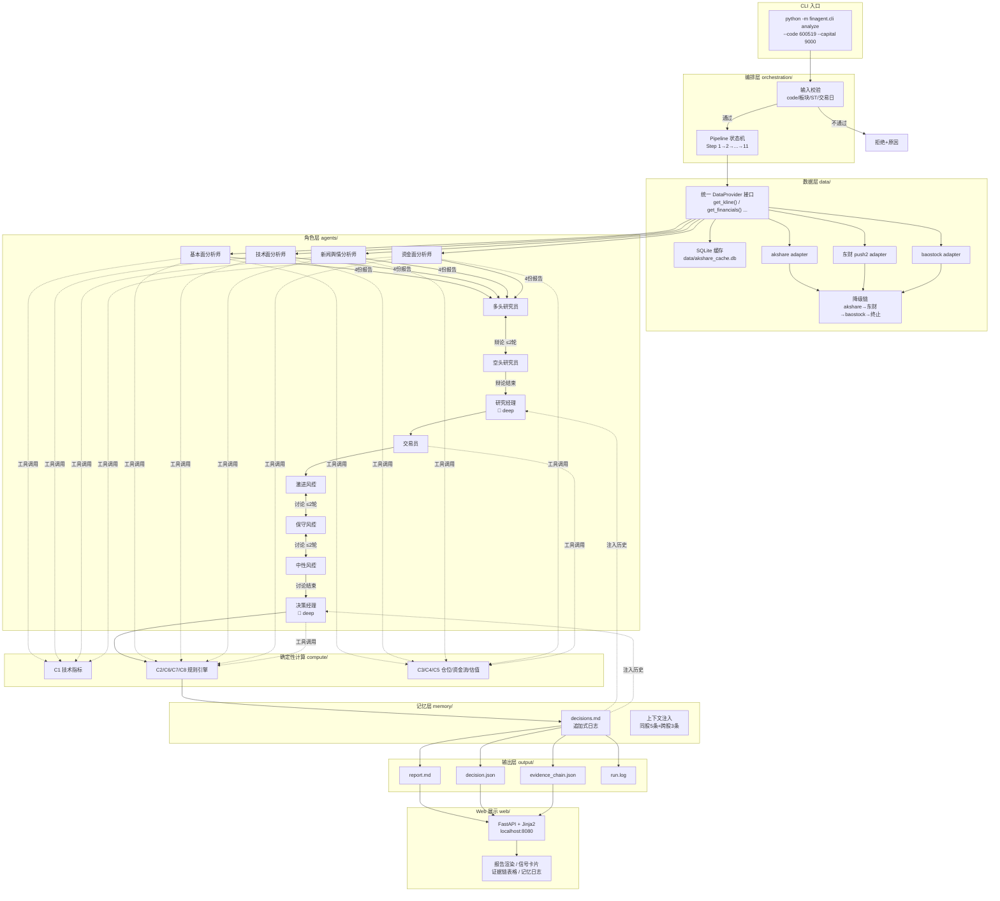
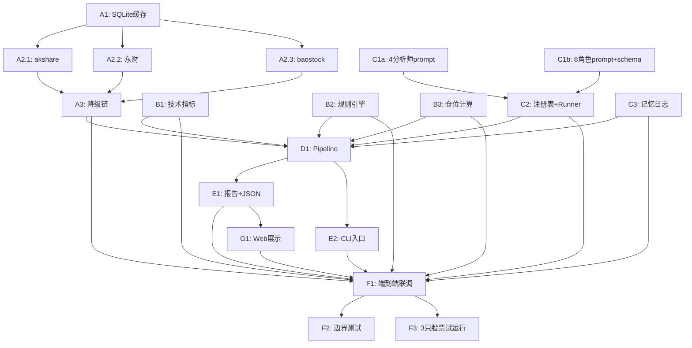

# 交易决策金融 Agent — 技术方案 v1.0

> 版本：v1.0 ｜ 作者：Architecture Engineer ｜ 日期：2026-08-12
> 基于：spec.md v1.1（Y1=A 无回测 / Y2=B CLI+本地Web / Y3=A 全中文）
> 前置调研：research/ 下 4 份报告（金融agent调研 / TradingAgents源码深挖 / FinRobot源码深挖 / A股开源项目盘点）

---

## 目录

1. [系统架构总览](#一系统架构总览)
2. [决策1：编排选型 — 自研轻量 Pipeline](#二决策1编排选型--自研轻量-pipeline)
3. [决策2：DeepSeek 双 LLM 映射](#三决策2deepseek-双-llm-映射)
4. [决策3：项目目录结构](#四决策3项目目录结构)
5. [决策4：数据层接口契约](#五决策4数据层接口契约)
6. [决策5：确定性计算工具集 C1-C8](#六决策5确定性计算工具集-c1-c8)
7. [决策6：12 角色 Prompt 模板框架](#七决策612-角色-prompt-模板框架)
8. [决策7：Web 层选型](#八决策7web-层选型)
9. [决策8：任务拆分与 Ticket 清单](#九决策8任务拆分与-ticket-清单)
10. [ADR 记录](#十adr-架构决策记录)

---

## 一、系统架构总览

### 1.1 架构图（Mermaid 源，可编辑）



### 1.2 架构说明

系统采用 **7 层模块化架构**，层间通过明确接口契约通信，每个模块边界清晰：

| # | 层 | 职责 | 依赖 |
|---|-----|------|------|
| 1 | `cli/` | 命令行入口，参数解析，触发 pipeline | orchestration |
| 2 | `orchestration/` | 自研轻量 Pipeline 状态机，编排 11 步流程（见决策1） | 所有下层 |
| 3 | `data/` | 统一 DataProvider 接口 + 3 源 adapter + SQLite 缓存 + 降级链（见决策4） | 无 |
| 4 | `compute/` | 确定性计算工具函数 C1-C8，纯 Python + Pydantic 校验（见决策5） | data（只取数） |
| 5 | `agents/` | 12 角色配置 + prompt + 结构化输出 schema（见决策6） | data, compute |
| 6 | `memory/` | 追加式 markdown 日志 + 上下文注入 | 无 |
| 7 | `output/` | 报告生成 + JSON 序列化 + 运行日志 | memory |
| 8 | `web/` | FastAPI + Jinja2 本地展示（见决策7） | output |

**数据流方向**：CLI → Orchestration → Data → Agents（并行）→ Debate（循环）→ Decision（串行）→ Rules → Memory → Output → Web

**并行策略**：4 分析师的工具调用可完全并行（各自独立数据），多空辩论和风控讨论为串行循环（需上下文依次传递）。

---

## 二、决策1：编排选型 — 自研轻量 Pipeline

### 问题

编排 11 步决策流程，候选方案：自研轻量 orchestrator vs 引入 LangGraph。

### 候选方案

| 方案 | 做法 | 优点 | 缺点 |
|------|------|------|------|
| **A. 自研轻量 Pipeline** | Python `Pipeline` 类 + 类型化 `PipelineState` dict + 条件循环 | 零外部依赖，完全可控，调试直观，符合 H3 从零自研约束 | 需手写条件逻辑（但流程固定，复杂度低） |
| **B. 引入 LangGraph** | LangGraph `StateGraph` + `add_node`/`add_conditional_edges` | 社区成熟（TradingAgents 同款），checkpoint 断点续跑，可视化 | 重型框架依赖，违反 H3；黑盒调试；学习成本 |

### 决策：**方案 A — 自研轻量 Pipeline**

### 理由

1. **H3 硬约束**：spec 明确要求"从零自研，不引入重型框架"。LangGraph 虽然不是"全家桶"级别，但它是一个完整的图状态机框架，引入了依赖链。
2. **流程固定不需要图灵活性**：本系统 11 步流程是线性的（校验→数据→4分析师并行→辩论→研究经理→交易员→风控三人→决策经理→规则复核→记忆→输出），只有两处条件循环（多空辩论、风控讨论），用 Python `for` 循环 + `while` 即可实现。
3. **可审计性**：自研 Pipeline 的每一步状态变化都在 `run.log` 中完全可见，调试时直接打断点即可。LangGraph 的图遍历在出错时难以定位。
4. **调研支撑**：FinRobot 用 AutoGen GroupChat、TradingAgents 用 LangGraph——两者各有适用场景。本项目的"固定流水线"特征更接近 TradingAgents 的显式图，但复杂度远低，不需要框架。

### Pipeline 模块划分

```
orchestration/
├── pipeline.py      # Pipeline 主类：run(code, **kwargs) → PipelineResult
├── state.py         # PipelineState 类型化字典
├── steps.py         # 11 个步骤的高阶函数
└── errors.py        # PipelineError / StepError / SkipStep
```

**11 步流程定义：**

| Step | 节点 | 输入 | 输出 | 类型 |
|------|------|------|------|------|
| 1 | 输入校验 | stock code | validated_code 或 reject | 确定性 |
| 2 | 数据就绪 | code | DataBundle（全部所需数据 + 缓存元数据） | 确定性 + LLM 无关 |
| 3 | 分析师并行 | DataBundle × 4 | 4 份 AnalysisReport | LLM quick × 4（可并行） |
| 4 | 多空辩论 | 4 份报告 | DebateRecord（bull_history, bear_history） | LLM quick × N 轮 |
| 5 | 研究经理综合 | DebateRecord + 4 份报告 | ResearchPlan（Pydantic 结构化） | LLM **deep** |
| 6 | 交易员方案 | ResearchPlan + 资金参数 | TraderAction（Pydantic 结构化） | LLM quick |
| 7 | 风控三人讨论 | TraderAction | RiskAssessment × 3 | LLM quick × N 轮 |
| 8 | 决策经理拍板 | 全部上游输出 | Decision（Pydantic = decision.json） | LLM **deep** |
| 9 | 规则引擎复核 | Decision + 规则集 | Decision（可能降级修正） | 确定性（C2/C6/C7/C8） |
| 10 | 记忆写入 | Decision + run context | memory/decisions.md 新增条目 | 确定性 |
| 11 | 输出生成 | 全部中间产物 | report.md + decision.json + evidence_chain.json + run.log | 确定性 + LLM 无关 |

**两处条件循环实现（伪码）：**

```python
# 多空辩论（Step 4）
debate_history = []
for round_idx in range(max_debate_rounds):
    bull_response = bull_researcher.run(debate_history + analyst_reports)
    debate_history.append(bull_response)
    bear_response = bear_researcher.run(debate_history + analyst_reports)
    debate_history.append(bear_response)
    if judge_debate_converged(bull_response, bear_response):
        break

# 风控讨论（Step 7）
for round_idx in range(max_risk_rounds):
    agg = risk_aggressive.run(risk_history + trader_action)
    con = risk_conservative.run(risk_history + trader_action)
    neu = risk_neutral.run(risk_history + trader_action)
    risk_history.extend([agg, con, neu])
    if judge_risk_converged([agg, con, neu]):
        break
```

---

## 三、决策2：DeepSeek 双 LLM 映射

### 问题

12 个角色需要双 LLM 分层（deep/quick），在只用 DeepSeek API 的前提下如何映射？两种候选：

### 候选方案

| 方案 | deep 角色（研究经理、决策经理） | quick 角色（其余10） | 成本/次（估算） |
|------|-------------------------------|---------------------|----------------|
| **A. deepseek-reasoner + deepseek-chat** | deepseek-reasoner（R1 深度思考，CoT 推理） | deepseek-chat（V3 快速生成） | ~¥0.25-0.35（控上下文） |
| **B. 同模型不同参数** | deepseek-chat（temperature=0, max_tokens=4096, CoT prompt） | deepseek-chat（temperature=0.7, max_tokens=1024） | ~¥0.08-0.12 |

### 决策：**方案 A — deepseek-reasoner（deep）+ deepseek-chat（quick）**

### 理由

1. **推理质量差异显著**：deepseek-reasoner 内置 CoT 推理链，适合"从多份矛盾信息中提炼投资逻辑与最终决策"这种复杂的综合判断任务。研究经理和决策经理承担的正是这类任务——同模型低 temperature 只能减少随机性，不能弥补推理深度不足。
2. **可审计性**：reasoner 的 CoT 推理链本身就是可审计的决策过程，写入 run.log 后可以作为决策解释的一部分。如果用户质疑"为什么给出 Buy 信号"，推理链直接提供依据。
3. **成本可控**：
   - 2 个 deep 角色，每个严格控制输入上下文 ≤ 3K tokens（只给上游摘要，不给全文），预计输出（含推理）≤ 8K tokens/次
   - 2 × (3K × ¥4/M + 8K × ¥16/M) = 2 × (0.012 + 0.128) ≈ ¥0.28
   - 10 个 quick 角色 × ~2K 输出 + ~2K 输入 = 40K × ¥2/M + 20K × ¥1/M ≈ ¥0.10
   - **合计 ~¥0.38，在 ¥0.5 预算内**
4. **Spec 明确要求"深思考"**：Spec 8.1 说"双 LLM 分层必须实现"，spec 角色表标注了 deep 角色。方案 B 虽然也实现了分层，但本质是"参数差异"而非"模型能力差异"。
5. **deepseek-chat 的缓存命中**：后续分析同一股票时，系统提示 + 工具定义可缓存，成本进一步降低。

### 模型配置

```python
# config/llm.py
LLM_CONFIG = {
    "deep": {
        "model": "deepseek-reasoner",
        "base_url": "https://api.deepseek.com",
        "max_tokens": 4096,        # 限制推理链长度，控制成本
        "temperature": 1.0,       # reasoner 推荐默认值
        "roles": ["research_manager", "portfolio_manager"],
    },
    "quick": {
        "model": "deepseek-chat",
        "base_url": "https://api.deepseek.com",
        "max_tokens": 1024,
        "temperature": 0.7,
        "roles": [
            "fundamentals", "technical", "news", "capital_flow",
            "bull", "bear", "trader",
            "risk_aggressive", "risk_conservative", "risk_neutral",
        ],
    },
}
```

### 成本控制手段

| 手段 | 实现 | 预期效果 |
|------|------|----------|
| Deep 角色上下文裁剪 | 只给深度角色传递上游摘要（≤ 3K tokens），不给全文 | 输入成本降低 60% |
| 分析师「思考→工具→清空」循环 | 每个分析师完成后清空消息列表，仅保留结构化输出 | 避免上下文爆炸 |
| 辩论轮次上限 | 默认 2 轮，`--debate-rounds` 可调 | 控制辩论阶段 token 消耗 |
| 工具调用收敛 | 每个分析师最多 5 次工具调用（`max_tool_calls=5`） | 防止无限循环 |
| API 重试控制 | 2 次重试 + 指数退避 | 避免失败时浪费 token |

### 成本估算明细（默认参数一次运行）

| 阶段 | 角色 | 模型 | 输入 tokens | 输出 tokens | 成本 |
|------|------|------|------------|------------|------|
| 分析师 ×4 | quick | chat | 4×2K=8K | 4×1.5K=6K | ¥0.020 |
| 多空辩论 ×2轮 | quick | chat | 2×3K=6K | 2×1.5K=3K | ¥0.012 |
| 研究经理 | deep | reasoner | 3K | 2K+6K(reasoning) | ¥0.140 |
| 交易员 | quick | chat | 2K | 1K | ¥0.004 |
| 风控三人 ×2轮 | quick | chat | 6×2K=12K | 6×1K=6K | ¥0.024 |
| 决策经理 | deep | reasoner | 3K | 2K+5K(reasoning) | ¥0.124 |
| **合计** | | | | | **≈ ¥0.324** |

> 注：deepseek-reasoner 的 reasoning tokens 按输出价格计费；实际消耗可能因股票复杂度浮动 ±30%。

---

## 四、决策3：项目目录结构

### 决策

采用标准的 Python `src`-layout（`finagent` 包），模块边界按架构分层划分：

```
financial-agent/
├── spec.md                          # 产品规格书（PM 维护）
├── architecture.md                  # 本文档（Architect 维护）
├── README.md
├── pyproject.toml                   # 项目配置 + 依赖声明
├── requirements.txt
│
├── finagent/                        # 主包 (src-layout)
│   ├── __init__.py
│   │
│   ├── cli/                         # 命令行入口
│   │   ├── __init__.py
│   │   └── main.py                  # analyze 命令 + 参数解析 (click/argparse)
│   │
│   ├── orchestration/               # 编排层 — Pipeline 状态机
│   │   ├── __init__.py
│   │   ├── pipeline.py              # Pipeline 主类
│   │   ├── state.py                 # PipelineState TypedDict
│   │   ├── steps.py                 # 11 步实现（step_1_validate, step_2_data, ...）
│   │   └── errors.py               # 自定义异常
│   │
│   ├── data/                        # 数据层 — 统一 DataProvider + adapter + 缓存
│   │   ├── __init__.py
│   │   ├── provider.py              # DataProvider 统一接口 (ABC)
│   │   ├── cache.py                 # SQLite 缓存层 (TTL/建表/补列/去重)
│   │   ├── sources/
│   │   │   ├── __init__.py
│   │   │   ├── akshare_adapter.py   # akshare 适配器
│   │   │   ├── eastmoney_adapter.py # 东财 push2 适配器
│   │   │   └── baostock_adapter.py  # baostock 适配器
│   │   ├── fallback.py              # 降级链实现
│   │   └── schemas.py               # 数据返回 schema (Pydantic)
│   │
│   ├── compute/                     # 确定性计算层 — C1-C8 工具函数
│   │   ├── __init__.py
│   │   ├── indicators.py            # C1 技术指标 (MA/MACD/RSI/布林带/高低点)
│   │   ├── rules.py                 # C2/C6/C7/C8 规则引擎 (涨跌停/T+1/板块/ST)
│   │   ├── position.py              # C3/C4/C5 仓位/资金流/估值
│   │   └── schemas.py               # 工具输入输出 Pydantic schema
│   │
│   ├── agents/                      # 角色层 — 配置 + prompt + schema
│   │   ├── __init__.py
│   │   ├── registry.py              # 角色注册表 (load from config/)
│   │   ├── runner.py                # AgentRunner: 构造→调用→重试→结构化解析
│   │   ├── prompts/
│   │   │   ├── __init__.py
│   │   │   ├── template.py          # Prompt 模板引擎 (Jinja2)
│   │   │   ├── analysts/            # 4 分析师 prompt
│   │   │   ├── researchers/         # 2 研究员 prompt
│   │   │   ├── managers/            # 研究经理 + 决策经理 prompt
│   │   │   ├── trader/              # 交易员 prompt
│   │   │   └── risk/               # 3 风控 prompt
│   │   └── schemas.py               # 结构化输出 schema (ResearchPlan/TraderAction)
│   │
│   ├── memory/                      # 记忆层 — 追加式 markdown 日志
│   │   ├── __init__.py
│   │   ├── log.py                   # TradingMemoryLog 写入/读取
│   │   └── context.py               # 上下文注入 (同股5条 + 跨股3条)
│   │
│   ├── output/                      # 输出层 — 报告生成 + JSON + 日志
│   │   ├── __init__.py
│   │   ├── report.py                # report.md 模板渲染 (Jinja2, 7节)
│   │   ├── decision.py              # decision.json 序列化 (Pydantic → JSON)
│   │   ├── evidence.py              # evidence_chain.json 证据链构建
│   │   └── logger.py                # run.log 审计日志
│   │
│   ├── web/                         # Web 展示层 (localhost 单机)
│   │   ├── __init__.py
│   │   ├── app.py                   # FastAPI app 入口
│   │   ├── templates/               # Jinja2 模板
│   │   │   ├── index.html           # 主页：报告 + 信号卡片 + 证据链 + 记忆日志
│   │   │   └── base.html            # 基础布局
│   │   └── static/                  # 静态资源
│   │       └── style.css
│   │
│   └── config/                      # 全局配置
│       ├── __init__.py
│       ├── settings.py              # 全局设置 (pydantic-settings)
│       ├── llm.py                   # LLM 配置 (见决策2)
│       └── roles.yaml               # 12 角色配置 YAML
│
├── memory/                          # 记忆日志存储 (运行时生成)
│   └── decisions.md
│
├── output/                          # 分析输出存储 (运行时生成)
│   └── <代码>/<日期>/
│       ├── report.md
│       ├── decision.json
│       ├── evidence_chain.json
│       └── run.log
│
├── data/                            # SQLite 缓存 + 附属文件
│   └── akshare_cache.db
│
├── tests/                           # 测试
│   ├── test_compute/                # 确定性计算单元测试 (pytest)
│   ├── test_data/                   # 数据层测试
│   ├── test_orchestration/          # Pipeline 测试
│   ├── test_memory/                 # 记忆日志测试
│   ├── test_output/                 # 输出层测试
│   └── conftest.py                  # fixtures (mock LLM, mock data)
│
└── research/                        # 调研报告 (PM 维护，只读)
    ├── 金融agent调研报告.md
    ├── TradingAgents源码深挖.md
    ├── FinRobot源码深挖.md
    └── A股金融agent开源项目盘点.md
```

### 设计原则

1. **每个目录是独立 module**：`__init__.py` 导出公开接口，内部实现细节不暴露给调用者
2. **config 驱动角色**：12 角色的职责、工具绑定、prompt 全部在 `roles.yaml` 中配置，加角色不改代码
3. **compute 无 LLM 依赖**：确定性计算模块不 import DeepSeek SDK，纯 Python + Pydantic
4. **output/web 只读访问**：输出层只写文件，Web 层只读文件——两者不互相依赖

---

## 五、决策4：数据层接口契约

### 决策：统一 `DataProvider` 抽象类 + Pydantic 返回 schema

采用**接口优先**设计：所有数据源的 adapter 都实现同一个 `DataProvider` 抽象接口，Pipeline 只依赖接口不依赖具体实现。

### DataProvider 接口

```python
# finagent/data/provider.py
from abc import ABC, abstractmethod
from typing import Optional
import pandas as pd
from finagent.data.schemas import (
    KlineData, RealTimeQuote, CapitalFlow,
    FinancialIndicators, ValuationData,
    NewsData, AnnouncementData, STRiskData, TradeCalendar,
)

class DataProvider(ABC):
    """统一数据提供者接口。所有 adapter 必须实现此接口。"""

    # 每个方法返回 Optional[Pydantic Model]。
    # 返回 None = 该源没有此数据 → 降级链继续尝试。

    @abstractmethod
    def get_kline(self, code: str, period: str = "day",
                  start_date: Optional[str] = None,
                  end_date: Optional[str] = None) -> Optional[KlineData]:
        """日K线（前复权）。对应 Spec D1。"""
        ...

    @abstractmethod
    def get_realtime_quote(self, code: str) -> Optional[RealTimeQuote]:
        """实时行情快照（现价/涨跌停价/量比）。对应 Spec D2。"""
        ...

    @abstractmethod
    def get_capital_flow(self, code: str) -> Optional[CapitalFlow]:
        """主力资金流（近5/10/20日净流入，超大单/大单/中单/小单）。Spec D3。"""
        ...

    @abstractmethod
    def get_margin_trading(self, code: str) -> Optional[dict]:
        """融资融券（融资余额/融券余额）。Spec D4。"""
        ...

    @abstractmethod
    def get_financials(self, code: str) -> Optional[FinancialIndicators]:
        """财务指标（ROE/营收净利同比/毛利率/负债率/EPS）。Spec D5。"""
        ...

    @abstractmethod
    def get_valuation(self, code: str) -> Optional[ValuationData]:
        """估值数据（PE/PB/股息率/总市值）。Spec D6。"""
        ...

    @abstractmethod
    def get_news(self, code: str, limit: int = 20) -> Optional[NewsData]:
        """新闻（标题/发布时间/来源/正文摘要）。Spec D7。"""
        ...

    @abstractmethod
    def get_announcements(self, code: str, limit: int = 20) -> Optional[AnnouncementData]:
        """公告（标题/日期/类型）。Spec D8。"""
        ...

    @abstractmethod
    def get_st_risk(self, code: str) -> Optional[STRiskData]:
        """ST/风险标记（证券简称、上市状态）。Spec D9。"""
        ...

    @abstractmethod
    def get_trade_calendar(self, year: Optional[int] = None) -> Optional[TradeCalendar]:
        """交易日历。Spec D10。"""
        ...

    @property
    @abstractmethod
    def name(self) -> str:
        """数据源名称（如 "akshare"），用于日志和降级链。"""
        ...
```

### 数据返回 Schema（Pydantic）

```python
# finagent/data/schemas.py
from pydantic import BaseModel
from datetime import date, datetime
from typing import Optional

class KlineRow(BaseModel):
    date: date
    open: float
    high: float
    low: float
    close: float
    volume: int
    amount: float
    pct_chg: float

class KlineData(BaseModel):
    code: str
    source: str
    period: str
    rows: list[KlineRow]
    cache_time: Optional[datetime] = None

class RealTimeQuote(BaseModel):
    code: str
    name: str
    price: float
    prev_close: float
    pct_chg: float
    limit_up: float      # 涨停价
    limit_down: float    # 跌停价
    volume_ratio: float  # 量比
    source: str
    cache_time: Optional[datetime] = None

class CapitalFlow(BaseModel):
    code: str
    net_inflow_5d: float   # 近5日主力净流入
    net_inflow_20d: float  # 近20日主力净流入
    super_large_order: float
    large_order: float
    medium_order: float
    small_order: float
    source: str
    cache_time: Optional[datetime] = None

class FinancialIndicators(BaseModel):
    code: str
    roe: float
    revenue_yoy: float      # 营收同比 %
    net_profit_yoy: float   # 净利同比 %
    gross_margin: float     # 毛利率 %
    debt_ratio: float       # 负债率 %
    eps: float
    source: str
    cache_time: Optional[datetime] = None

class ValuationData(BaseModel):
    code: str
    pe: float
    pb: float
    dividend_yield: float
    market_cap: float       # 总市值（亿）
    source: str
    cache_time: Optional[datetime] = None

class NewsItem(BaseModel):
    title: str
    publish_time: datetime
    source_name: str
    summary: str

class NewsData(BaseModel):
    code: str
    items: list[NewsItem]
    source: str
    cache_time: Optional[datetime] = None

class AnnouncementItem(BaseModel):
    title: str
    date: date
    ann_type: str  # 公告类型

class AnnouncementData(BaseModel):
    code: str
    items: list[AnnouncementItem]
    source: str
    cache_time: Optional[datetime] = None

class STRiskData(BaseModel):
    code: str
    name: str            # 证券简称（检查是否含 ST/*ST）
    is_st: bool
    is_star_st: bool
    is_listed: bool
    source: str
    cache_time: Optional[datetime] = None

class TradeCalendar(BaseModel):
    trade_dates: list[date]
    source: str
    cache_time: Optional[datetime] = None
```

### 降级链实现

```python
# finagent/data/fallback.py
class FallbackDataProvider:
    """降级链：按优先级依次尝试多个 adapter，任一成功即返回。"""

    def __init__(self, adapters: list[DataProvider], cache: 'AkshareCache'):
        self.adapters = adapters
        self.cache = cache

    async def get_kline(self, code: str, **kwargs) -> KlineData:
        missing = []
        for adapter in self.adapters:
            try:
                result = adapter.get_kline(code, **kwargs)
                if result is not None:
                    return result
                missing.append(adapter.name)
            except Exception as e:
                missing.append(f"{adapter.name}({e})")
        raise DataUnavailableError(
            f"all sources failed for kline({code}): {missing}"
        )
```

**降级链配置（优先级从高到低）**：

| 数据类型 | 降级顺序 |
|----------|----------|
| 日K线 (D1) | akshare → 东财 push2 → baostock |
| 实时行情 (D2) | 东财 push2 → akshare |
| 主力资金 (D3) | 东财 push2 → akshare |
| 融资融券 (D4) | akshare → (无备源) |
| 财务指标 (D5) | baostock → akshare |
| 估值 (D6) | akshare → baostock |
| 新闻 (D7) | akshare → 东财 |
| 公告 (D8) | 东财 → akshare |
| ST标记 (D9) | akshare → 东财 |
| 交易日历 (D10) | akshare → 硬编码兜底 |

### SQLite 缓存层 API

```python
# finagent/data/cache.py
class AkshareCache:
    """参考 A_Share_investment_Agent 的 SQLite 缓存模式。"""

    def __init__(self, db_path: str = "data/akshare_cache.db"):
        self.db_path = db_path

    def get(self, table: str, key: dict, ttl: timedelta) -> Optional[pd.DataFrame]:
        """按主键查询缓存，TTL 内命中返回数据，否则返回 None。"""
        ...

    def put(self, table: str, key: dict, data: pd.DataFrame) -> None:
        """写入/覆盖缓存，自动建表、补列、去重（主键 = 代码+日期/时间粒度）。"""
        ...

    def hit_rate(self) -> dict:
        """返回缓存命中统计（用于 run.log）。"""
        ...
```

**缓存 TTL 策略（与 Spec 第五节一致）：**

| 数据 | TTL |
|------|-----|
| 日K线 | 1 天 |
| 实时行情 | 15 分钟 |
| 主力资金流 | 15 分钟 |
| 融资融券 | 1 天 |
| 财务指标 | 30 天 |
| 估值 | 1 天 |
| 新闻 | 12 小时 |
| 公告 | 12 小时 |
| ST标记 | 1 天 |
| 交易日历 | 365 天 |

---

## 六、决策5：确定性计算工具集 C1-C8

### 决策

所有计算为**纯函数 + Pydantic 参数校验**，借鉴 FinRobot 的 `Annotated` 自描述模式，LLM 只传参、读结果，不参与任何数值计算。

### 工具函数签名与归属

```python
# finagent/compute/indicators.py  — C1 技术指标
from pydantic import BaseModel, Field
from datetime import date
from typing import Optional

class KlineInput(BaseModel):
    kline_rows: list[dict]  # [{date, open, high, low, close, volume}]

class TechIndicators(BaseModel):
    ma5: list[Optional[float]]      # 5日均线序列（与K线同长度）
    ma20: list[Optional[float]]     # 20日均线
    ma60: list[Optional[float]]     # 60日均线
    macd_dif: list[Optional[float]] # MACD DIF
    macd_dea: list[Optional[float]] # MACD DEA
    macd_bar: list[Optional[float]] # MACD 柱
    rsi_14: list[Optional[float]]   # 14日 RSI
    boll_upper: list[Optional[float]] # 布林带上轨
    boll_mid: list[Optional[float]]   # 布林带中轨
    boll_lower: list[Optional[float]] # 布林带下轨
    vol_ma5: list[Optional[float]]  # 5日量均线
    recent_high: float              # 近期高点（60日）
    recent_low: float               # 近期低点（60日）

def compute_indicators(kline: KlineInput) -> TechIndicators:
    """C1：从日K线计算全部技术指标。纯 Python 实现，不调任何外部库。"""
    ...


# finagent/compute/rules.py  — C2/C6/C7/C8 规则引擎

class LimitPriceInput(BaseModel):
    prev_close: float
    is_st: bool = False

class LimitPriceOutput(BaseModel):
    limit_up: float       # 涨停价
    limit_down: float     # 跌停价
    rate: float           # 涨跌幅限制（0.10 或 0.05）

def compute_limit_price(input: LimitPriceInput) -> LimitPriceOutput:
    """C2：计算涨跌停价。ST 股票 ±5%，非 ST ±10%。"""
    ...


class TradeDayInput(BaseModel):
    date: date
    trade_calendar: list[date]

class TradeDayOutput(BaseModel):
    is_trading_day: bool
    next_trading_day: date
    t_plus_1_day: date   # T+1 生效日

def compute_trade_day(input: TradeDayInput) -> TradeDayOutput:
    """C6：判断交易日 + T+1 生效日 + 下一交易日。"""
    ...


class BoardCheckInput(BaseModel):
    code: str  # 6位数字代码

class BoardCheckOutput(BaseModel):
    is_main_board: bool       # 是否沪深主板 60/00
    board_name: str           # "沪主板"/"深主板"/"创业板"/"科创板"/"北交所"/"未知"
    reason: str               # 不通过的原因

def check_board(input: BoardCheckInput) -> BoardCheckOutput:
    """C7：板块校验 — 只接受沪深主板 60xxxx / 000-003xxxx。"""
    ...


class RuleReviewInput(BaseModel):
    decision: dict            # decision.json 的字典形式
    st_info: STRiskData
    quote: RealTimeQuote
    capital: float
    trade_calendar: list[date]

class RuleReviewOutput(BaseModel):
    decision: dict            # 可能被降级修正后的 decision
    corrections: list[str]    # 修正记录（如"ST禁Buy→降级为Hold"）
    executability: dict       # 可执行性标注

def review_decision(input: RuleReviewInput) -> RuleReviewOutput:
    """C8：规则引擎复核 — R1-R6 六条规则全部检查并可能降级修正。"""
    ...


# finagent/compute/position.py  — C3/C4/C5 仓位/资金流/估值

class PositionInput(BaseModel):
    capital: float            # 可用资金
    current_price: float      # 现价
    position_pct: float       # 仓位占比 {0.0, 0.25, 0.50, 0.75}
    per_lot: int = 100        # A股一手100股

class PositionOutput(BaseModel):
    shares: int               # 建议股数（100整数倍）
    actual_pct: float         # 实际仓位占比
    cost: float               # 预计成本
    zero_share_reason: str = ""  # 资金不足一手的原因

def compute_position(input: PositionInput) -> PositionOutput:
    """C3：手数/仓位计算。floor(capital × pct / (price × 100)) × 100。"""
    ...


class CapitalFlowSummary(BaseModel):
    net_inflow_5d: float
    net_inflow_20d: float
    direction_5d: str     # "净流入"/"净流出"
    direction_20d: str

def aggregate_capital_flow(flow: CapitalFlow) -> CapitalFlowSummary:
    """C4：资金面聚合 — 近5/20日净流入汇总、方向判断。"""
    ...


def get_valuation_snapshot(val: ValuationData) -> dict:
    """C5：估值引用 — PE/PB/股息率直接取数，LLM 不计算。"""
    return {
        "pe": val.pe,
        "pb": val.pb,
        "dividend_yield": val.dividend_yield,
        "market_cap": val.market_cap,
    }
```

### 规则引擎 R1-R6（硬编码）

| 规则 | 条件 | 动作 |
|------|------|------|
| R1 | 非 60/00 主板 | Pipeline Step 1 拒绝 |
| R2 | 含 `*ST` | Pipeline Step 1 拒绝 |
| R3 | 含 `ST`（非\*ST） | 允许分析，Step 9 强制 signal ≠ Buy |
| R4 | 资金不足 1 手 | 仓位档位降为 0，记录原因 |
| R5 | 涨停价 | Buy 信号标记 `limit_up=true` |
| R6 | 跌停价 | Sell 信号标记 `limit_down=true` |
| R7 | 非交易日 | 自动使用最近交易日数据 |

---

## 七、决策6：12 角色 Prompt 模板框架

### 决策

采用 **Jinja2 模板 + `roles.yaml` 配置驱动** 模式：每个角色的职责描述和工具绑定从 YAML 配置读取，prompt 模板用 Jinja2 渲染注入运行时数据。借鉴 FinRobot 的配置 dict 模式。

### 配置文件结构

```yaml
# finagent/config/roles.yaml
roles:
  fundamentals:
    type: analyst
    llm_layer: quick
    name: "基本面分析师"
    description: >
      你是一位资深的基本面分析师，专注于A股财报分析。你的任务是基于提供的财务数据，
      分析该公司的盈利能力、成长性、估值水平和财务风险。你必须用中文输出分析报告。
    tools: [get_financials, get_valuation]
    output_format: free_text       # 自由文本
    context_inject: [kline_summary, financials, valuation, st_risk]
    max_tool_calls: 5

  technical:
    type: analyst
    llm_layer: quick
    name: "技术面分析师"
    description: >
      你是一位经验丰富的技术分析师，精通K线形态、均线系统和技术指标。
      基于提供的日K线数据和技术指标，分析趋势、支撑/压力位、量价关系和买卖信号。
      所有技术指标数值由系统计算提供，你只做分析和判断。用中文输出。
    tools: [compute_indicators]
    output_format: free_text
    context_inject: [kline_summary, indicators]
    max_tool_calls: 5

  # ... (其余 10 个角色同理，完整定义见 roles.yaml)

  research_manager:
    type: manager
    llm_layer: deep
    name: "研究经理"
    description: >
      你是研究经理，负责综合多空辩论双方的论点，提炼核心矛盾，形成投资研判计划。
      你需要分析多空双方的核心论据，判断哪方逻辑更强，找出关键风险和机会。
      输出结构化的研究计划。用中文输出。
    tools: []
    output_format: structured     # Pydantic ResearchPlan
    context_inject: [analyst_reports, debate_record, memory_context]
    max_tool_calls: 0

  portfolio_manager:
    type: manager
    llm_layer: deep
    name: "决策经理"
    description: >
      你是投资组合经理（决策经理），负责综合所有上游分析、辩论和风控评估，
      做出最终交易决策。你需要权衡收益与风险，考虑用户资金约束和市场条件，
      输出最终信号（Buy/Hold/Sell）和仓位档位。所有数字由系统计算，你只做推理和判断。
      用中文输出，决策要有充分理由。
    tools: []
    output_format: structured     # Pydantic Decision (=decision.json 契约)
    context_inject: [all_upstream, risk_assessments, memory_context, rule_review]
    max_tool_calls: 0
```

### Prompt 模板框架

```python
# finagent/agents/prompts/template.py
from jinja2 import Template

ROLE_TEMPLATE = Template("""
# 角色
{{ role.description }}

# 分析标的
股票代码：{{ code }}
股票名称：{{ name }}
分析日期：{{ date }}
用户资金：{{ capital }}元
持仓状态：{{ position_status }}

# 数据

## {{ section.title }}
{{ section.content }}


# 输出要求

请按照以下 JSON schema 输出（严格符合格式）：
{{ role.output_schema }}

请用中文自由文本输出分析报告，包含结论和数据依据。每个关键数字必须注明数据来源。


# 注意事项
- 所有数字由系统计算提供，你不得自行计算或编造数字
- 如果数据不足以支撑判断，请明确说明
- 最终结论必须包含风险提示
""")
```

### 每角色要点速查（完整 12 份 prompt 由 Coder 按此框架编写）

| # | 角色 | 核心要点 | 特殊约束 |
|---|------|----------|----------|
| 1 | 基本面分析师 | 财报趋势、ROE/毛利率、估值水平、分红、ST风险 | 财务数字全部引用系统数据，不自行计算 |
| 2 | 技术面分析师 | 趋势方向、均线排列、MACD/RSI信号、支撑压力、量价配合 | 技术指标数值全部来自 compute_indicators() 输出 |
| 3 | 新闻舆情分析师 | 近期新闻情绪、公告影响、政策法规、市场热点 | 每条观点必须有新闻标题+时间+来源 |
| 4 | 资金面分析师 | 主力资金方向、大单动向、（可选）融资融券 | 资金流向数字来自系统，不自行判断 |
| 5 | 多头研究员 | 从4份报告提取看涨论据，形成多方案，回应空头质疑 | 只读4份分析师报告，不调工具 |
| 6 | 空头研究员 | 从4份报告提取看跌论据，形成空方案，回应多头质疑 | 同上 |
| 7 | 研究经理 | 综合辩论，判断核心矛盾，输出结构化研究计划 | deep thinking，结构化输出 |
| 8 | 交易员 | 研判→交易方案：价格区间/仓位/止损/目标 | 手数由系统 C3 计算 |
| 9 | 激进风控 | 进攻视角：评估机会大小、是否值得承担风险 | 倾向覆盖"可"的条件 |
| 10 | 保守风控 | 防守视角：评估下行风险、回撤可能、黑天鹅 | 倾向覆盖"不可"的条件 |
| 11 | 中性风控 | 平衡攻守：综合评估，给出中立意见 | 倾向给"有条件通过" |
| 12 | 决策经理 | 综合全部输入，拍板最终信号+仓位+理由+风险 | deep thinking，结构化输出 decision.json |

### 角色运行器

```python
# finagent/agents/runner.py
class AgentRunner:
    def __init__(self, role_config: dict, llm_client, tools: list):
        self.config = role_config
        self.llm = llm_client
        self.tools = tools

    def run(self, context: dict) -> str | BaseModel:
        """运行一次 agent：构造 prompt → 调 LLM → 解析输出。
        若 structured 模式且解析失败 → 重试最多 2 次。"""
        ...
```

---

## 八、决策7：Web 层选型

### 问题

Spec 8.4 要求本地 Web 展示最近一次分析结果（localhost 单机），候选：FastAPI + Jinja2 vs Streamlit。

### 候选方案

| 方案 | 做法 | 优点 | 缺点 |
|------|------|------|------|
| **A. FastAPI + Jinja2** | 标准 Python Web 框架 + 模板引擎，一个 `app.py` + 一个 HTML 模板 | 显式控制，无魔法；依赖轻（fastapi + uvicorn + jinja2）；易于扩展 | 需手写 HTML 模板（但本场景只需一个页面） |
| **B. Streamlit** | `streamlit run app.py`，内置 markdown 渲染、DataFrame 表格 | 极快开发（~30行代码），自动热更新 | 引入一个中等框架；自动重跑逻辑不够显式；不易定制布局 |

### 决策：**方案 A — FastAPI + Jinja2**

### 理由

1. **依赖更轻**：FastAPI + uvicorn + jinja2 三个包，streamlit 依赖树更大（含 tornado、altair、plotly 等）
2. **符合 H3 从零自研精神**：FastAPI 是 API 框架而非应用框架，控制权在开发者手中；Streamlit 接管了整个应用生命周期
3. **更明确的控制**：本地展示页面只渲染 markdown + JSON，不需要 Streamlit 的重跑、缓存、会话管理等机制
4. **Spec 8.4 列出的两个候选之一**：FastAPI 和 Streamlit 都是 spec 认可的轻量方案，选 FastAPI 更偏向"显式控制"路线
5. **实现量并不大**：一个 HTML 模板 + 一个路由 = ~150 行代码

### Web 层设计

```python
# finagent/web/app.py
from fastapi import FastAPI
from fastapi.responses import HTMLResponse
from jinja2 import Environment, FileSystemLoader

app = FastAPI(title="FinAgent Viewer")

@app.get("/", response_class=HTMLResponse)
async def view_last_analysis():
    """读取最近一次分析输出，渲染到页面。"""
    ...

@app.get("/api/latest", response_class=HTMLResponse)
async def api_latest():
    """JSON API：最近一次 decision.json 内容。"""
    ...
```

**启动方式：**

```bash
cd financial-agent
uvicorn finagent.web.app:app --host 127.0.0.1 --port 8080
```

**展示内容（单一页面）：**
1. report.md 渲染（markdown → HTML）
2. decision.json 信号与仓位卡片（Buy/Hold/Sell 醒目展示）
3. 证据链表格（HTML table）
4. 记忆日志（memory/decisions.md 最后 20 条）
5. 免责声明（固定文本，页面底部）

---

## 九、决策8：任务拆分与 Ticket 清单

### 拆分原则

基于 Spec 第十节的组 A-G 拆解，按 **契约先行、依赖最小化、并行最大化** 原则，将每个组拆成可独立开发/测试的 ticket。

- **并行组**：B/C/E/G 可与 A 并行（只需等待字段契约，spec 已提供）
- **串行组**：A → D → F（关键路径）
- **每个 ticket 含**：标题、body 要点、依赖、assignee 建议

### Ticket 清单

---

**组 A：数据层（先行，关键路径入口）**

---

#### Ticket A1：SQLite 缓存层

- **标题**：实现 SQLite 缓存层（TTL/自动建表/补列/去重）
- **body 要点**：
  - 实现 `finagent/data/cache.py` 的 `AkshareCache` 类
  - 数据库文件：`data/akshare_cache.db`
  - TTL 策略：按 spec 第五节 10 类数据分别配置
  - 主键 = 代码 + 日期/时间粒度；写入时自动建表、补列、去重
  - `get()` 返回 Optional[pd.DataFrame]，`put()` 写入/覆盖
  - `hit_rate()` 返回缓存统计
  - 单元测试：TTL 过期/未过期、去重、补列场景
- **依赖**：无
- **并行建议**：可与 A2.x 并行（契约独立）
- **assignee 建议**：coder

---

#### Ticket A2.1：akshare adapter

- **标题**：实现 akshare 数据源适配器（DataProvider 接口）
- **body 要点**：
  - 实现 `finagent/data/sources/akshare_adapter.py`，实现 `DataProvider` 全部 10 个方法
  - 返回标准 Pydantic schema（`KlineData`, `RealTimeQuote`, ...）
  - 每个方法先查缓存，未命中再调 akshare API，调完写入缓存
  - 捕获 akshare 异常并返回 None（触发降级链）
  - 覆盖数据：D1(日K线) / D2(行情) / D3(资金流) / D4(融资融券) / D5(财务) / D6(估值) / D7(新闻) / D9(ST标记) / D10(交易日历)
- **依赖**：A1（缓存层接口）
- **并行建议**：A2.1/A2.2/A2.3 可完全并行
- **assignee 建议**：coder

---

#### Ticket A2.2：东财 push2 adapter

- **标题**：实现东财 push2 数据源适配器
- **body 要点**：
  - 实现 `finagent/data/sources/eastmoney_adapter.py`
  - 覆盖数据：D1(日K线备源) / D2(实时行情主源) / D3(主力资金主源) / D8(公告主源) / D9(ST标记备源)
  - 复用 stock-lab 项目已有的东财 push2 经验
- **依赖**：A1
- **并行建议**：与 A2.1/A2.3 并行
- **assignee 建议**：coder

---

#### Ticket A2.3：baostock adapter

- **标题**：实现 baostock 数据源适配器
- **body 要点**：
  - 实现 `finagent/data/sources/baostock_adapter.py`
  - 覆盖数据：D1(日K线备源) / D5(财务主源，baostock 财务三表数据完整) / D6(估值备源)
  - 注意 baostock 的登录/登出生命周期
- **依赖**：A1
- **并行建议**：与 A2.1/A2.2 并行
- **assignee 建议**：coder

---

#### Ticket A3：降级链 + 统一数据接口

- **标题**：实现降级链 + FallbackDataProvider + DataBundle 聚合
- **body 要点**：
  - 实现 `finagent/data/fallback.py` 的 `FallbackDataProvider`
  - 10 类数据各自的降级顺序配置（akshare→东财→baostock）
  - 实现 `DataBundle` 聚合类：一次拉取全部 10 类数据
  - 任一数据全部源失败 → 终止流程并报告缺失清单
  - 集成测试：模拟各源失败，验证降级链路
- **依赖**：A2.1, A2.2, A2.3
- **并行建议**：等待 A2.x 完成后串行
- **assignee 建议**：coder

---

**组 B：确定性计算（可与 A 并行）**

---

#### Ticket B1：技术指标计算 C1

- **标题**：实现技术指标计算工具（MA/MACD/RSI/布林带/量均线/高低点）
- **body 要点**：
  - 实现 `finagent/compute/indicators.py`
  - 纯 Python/Pandas/numpy 实现，不依赖任何 LLM
  - 输入 Pydantic KlineInput，输出 TechIndicators
  - 覆盖：MA5/20/60、MACD(DIF/DEA/柱)、RSI-14、布林带(上中下)、量均线5日、近期高低点(60日)
  - 单元测试：用已知数据验证计算结果
- **依赖**：无（只需 K线数据契约，spec 已定义）
- **并行建议**：可与 A/B2/B3 完全并行
- **assignee 建议**：algorithm

---

#### Ticket B2：规则引擎 C2/C6/C7/C8

- **标题**：实现规则引擎（涨跌停价/T+1/板块校验/规则复核 R1-R6）
- **body 要点**：
  - 实现 `finagent/compute/rules.py`
  - C2 涨跌停价：`compute_limit_price()` — 非ST ±10%，ST ±5%
  - C6 T+1/交易日：`compute_trade_day()` — 判断交易日 + 下一交易日 + T+1日
  - C7 板块校验：`check_board()` — 60/00主板放行，300/688/8xx/4xx拒绝
  - C8 规则复核：`review_decision()` — R1-R6 全部检查，冲突则降级修正并记录
  - 单元测试：覆盖所有边界（ST/*ST/涨停/跌停/资金不足/非交易日）
- **依赖**：无（只需数据契约）
- **并行建议**：可与 A/B1/B3 完全并行
- **assignee 建议**：algorithm

---

#### Ticket B3：仓位手数 + 资金流 + 估值计算 C3/C4/C5

- **标题**：实现仓位手数/资金流聚合/估值引用工具
- **body 要点**：
  - 实现 `finagent/compute/position.py`
  - C3 手数/仓位：`compute_position()` — floor(capital×pct/(price×100))×100，资金不足一手返回0
  - C4 资金流聚合：`aggregate_capital_flow()` — 近5/20日净流入汇总
  - C5 估值引用：`get_valuation_snapshot()` — PE/PB/股息率直接取数
  - 单元测试：各种仓位和价格组合
- **依赖**：无
- **并行建议**：可与 A/B1/B2 完全并行
- **assignee 建议**：algorithm

---

**组 C：角色层（可与 A/B 并行）**

---

#### Ticket C1a：4 分析师 prompt 编写

- **标题**：编写基本面/技术面/新闻舆情/资金面 4 分析师 prompt
- **body 要点**：
  - 按决策6的模板框架，编写 4 份 Jinja2 prompt 文件
  - 每个 prompt 含角色描述 + 数据注入 + 输出要求
  - 参考 spec 第四节每角色的职责与工具绑定
  - 中文输出；每个关键数字必须带数据来源
  - 验收：用 mock 数据调 DeepSeek API，确认输出格式和质量
- **依赖**：无（只需字段契约）
- **并行建议**：C1a 和 C1b 可并行
- **assignee 建议**：coder

---

#### Ticket C1b：研究员/交易员/风控/经理 prompt + 结构化输出 schema

- **标题**：编写 8 角色 prompt + 结构化输出 schema（ResearchPlan/TraderAction/Decision）
- **body 要点**：
  - 多头/空头研究员 prompt（辩论模式，需能引用+回应）
  - 研究经理 prompt（deep thinking，输出 ResearchPlan）
  - 交易员 prompt（输出 TraderAction schema）
  - 激进/保守/中性风控 prompt（各带倾向）
  - 决策经理 prompt（deep thinking，输出 decision.json schema）
  - 3 个 Pydantic schema 定义在 `finagent/agents/schemas.py`
  - 验收：用 mock 上游数据调 API 验证 schema 解析通过率
- **依赖**：无
- **并行建议**：C1a 和 C1b 可并行；可与 C2/C3 并行
- **assignee 建议**：coder

---

#### Ticket C2：角色注册表 + AgentRunner

- **标题**：实现角色注册表 + AgentRunner（LLM 调用/重试/结构化解析）
- **body 要点**：
  - `finagent/agents/registry.py`：从 `roles.yaml` 加载 12 角色配置
  - `finagent/agents/runner.py`：AgentRunner.run() — 渲染 prompt → 调 LLM → 解析输出
  - 支持 structured 模式：Pydantic 解析失败 → 最多重试 2 次
  - 支持 free_text 模式：直接返回原始文本
  - 支持工具调用循环：analysis → tool_call → analysis（最多 5 轮）
  - 支持「思考→工具→清空」：每个分析师完成后清空消息列表
  - 单元测试：mock LLM 响应，验证各类输出模式
- **依赖**：C1a, C1b（prompt 就绪）
- **并行建议**：等待 C1 完成后串行
- **assignee 建议**：coder

---

#### Ticket C3：记忆日志模块

- **标题**：实现追加式 markdown 记忆日志（Phase A 写入 + 上下文注入）
- **body 要点**：
  - `finagent/memory/log.py`：TradingMemoryLog — 追加式写入 `memory/decisions.md`
  - 条目格式：`[日期 | 代码 | 信号 | 仓位 | pending]` + DECISION（见 spec 第七节）
  - 幂等防重：同日同代码不重复写
  - `finagent/memory/context.py`：`get_past_context(code)` — 同股最近5条 + 跨股最近3条
  - HTML 注释分隔符防 LLM 输出干扰解析
  - 单元测试：写入/去重/上下文注入
- **依赖**：无（完全独立模块）
- **并行建议**：可与 A/B/C 全部并行
- **assignee 建议**：coder

---

**组 D：编排层（依赖 A/B/C 接口）**

---

#### Ticket D1：Pipeline 状态机

- **标题**：实现自研轻量 Pipeline 状态机（11 步编排）
- **body 要点**：
  - `finagent/orchestration/pipeline.py`：Pipeline 主类
  - `finagent/orchestration/state.py`：PipelineState TypedDict
  - `finagent/orchestration/steps.py`：11 个高阶函数
  - 两处条件循环：多空辩论（for+条件break）、风控讨论（for+条件break）
  - 错误处理：任一环节失败 → run.log 记录 → 终止或跳过
  - CLI 挂载：`finagent/cli/main.py` 的 `analyze` 命令调用流水线
  - 集成测试：用 mock data + mock LLM 跑完整流水线
- **依赖**：A3（数据层）, B1/B2/B3（计算层）, C2（角色层）
- **并行建议**：等待 A/B/C 完成后串行
- **assignee 建议**：coder

---

**组 E：输出层（可与 A/B/C 并行）**

---

#### Ticket E1：报告生成 + decision.json 序列化

- **标题**：实现 report.md 模板渲染 + decision.json 序列化 + 证据链构建
- **body 要点**：
  - `finagent/output/report.py`：Jinja2 渲染 7 节报告
  - `finagent/output/decision.py`：decision.json 序列化（Pydantic → JSON）
  - `finagent/output/evidence.py`：证据链构建（遍历 PipelineState，提取数字出处）
  - `finagent/output/logger.py`：run.log 审计日志（每步耗时/token/缓存命中/降级/规则修正）
  - 报告结构：摘要/4分析师分项/辩论纪要/研究经理研判/交易方案+风控/决策结论/证据链附录+免责声明
  - 单元测试：用 mock PipelineState 验证输出格式
- **依赖**：无（只需输出格式契约，spec 已定义）
- **并行建议**：可与 A/B/C 完全并行
- **assignee 建议**：coder

---

#### Ticket E2：CLI 入口

- **标题**：实现 CLI 命令行入口（参数解析 + 调用 Pipeline）
- **body 要点**：
  - `finagent/cli/main.py`：使用 click 或 argparse
  - 参数：`--code` (必填), `--period` (默认day), `--capital` (默认9000), `--position-status`, `--debate-rounds`, `--risk-rounds`
  - 输入校验：代码格式/板块/ST（确定性验证，比 Pipeline Step 1 更早拒绝明显无效输入）
  - 运行命令：`python -m finagent.cli analyze --code 600519 --capital 9000`
  - 输出文件路径打印到 stdout
- **依赖**：D1（Pipeline）
- **并行建议**：可与 E1 并行，与 D1 串行
- **assignee 建议**：coder

---

**组 G：Web 展示层（可与 E/F 并行）**

---

#### Ticket G1：FastAPI Web 服务 + 展示页面

- **标题**：实现本地 Web 展示服务（FastAPI + Jinja2，localhost 单机）
- **body 要点**：
  - `finagent/web/app.py`：FastAPI app，一个路由 `GET /`
  - `finagent/web/templates/index.html`：单一页面模板
  - 展示内容（4 区）：
    1. report.md 渲染（markdown→HTML，可用 Python markdown 库）
    2. decision.json 信号与仓位卡片（Buy=绿/Hold=黄/Sell=红）
    3. 证据链表格（HTML table，只读）
    4. 记忆日志最近 20 条（从 memory/decisions.md 解析）
  - 底部固定免责声明
  - 无用户系统/登录/多股票管理
  - 启动：`uvicorn finagent.web.app:app --host 127.0.0.1 --port 8080`
- **依赖**：E1（输出文件格式契约）
- **并行建议**：可与 D/F 并行
- **assignee 建议**：coder

---

**组 F：集成与验收（依赖全部）**

---

#### Ticket F1：端到端联调（A1-A9 验收）

- **标题**：端到端集成联调 + 9 项验收标准逐项验证
- **body 要点**：
  - 拉通全部模块：CLI → Pipeline → Data → Agents → Compute → Memory → Output
  - 跑通 3 只真实股票（如 600519/601318/000858）
  - A1-A9 九项验收逐项验证（见 spec 第九节）
  - 记录实际 token 消耗和耗时，验证 ≤ ¥0.5 + ≤ 3分钟
  - 输出验收报告
- **依赖**：D1, E1, E2, G1（所有模块就绪）
- **并行建议**：最后串行
- **assignee 建议**：qa

---

#### Ticket F2：边界样例测试集

- **标题**：编写边界测试用例 + 验证所有边界场景
- **body 要点**：
  - 非主板代码（300750/688981）：验证拒绝
  - *ST 代码：验证拒绝
  - 普通 ST 代码：验证信号 ≠ Buy
  - 涨停股票：验证可执行性标记
  - 跌停股票：验证可执行性标记
  - 资金不足一手：验证仓位降级为 0
  - 数据源部分失败：验证降级链
  - 所有确定性计算规则 R1-R6 的边界覆盖
  - 输出测试报告
- **依赖**：F1（至少端到端基本跑通）
- **并行建议**：与 F1 部分并行（先写测试用例，等 F1 通过后执行验证）
- **assignee 建议**：qa

---

#### Ticket F3：3 只真实股票试运行（含缓存验证）

- **标题**：3 只股票独立试运行 + 缓存二次命中验证
- **body 要点**：
  - 用 `--code 600519 --capital 9000` 等参数各跑 2 次
  - 第 1 次：无缓存，验证完整流程和数据拉取
  - 第 2 次：验证 run.log 显示未过期数据全部 "cache hit"
  - 对比两次决策一致性（允许 LLM 输出有微小差异，信号/仓位应一致）
  - 输出试运行报告
- **依赖**：F1
- **并行建议**：可与 F2 并行
- **assignee 建议**：qa

---

### 依赖关系图（Mermaid 源，可编辑）



### 建议排期（含并行人天估算）

| 阶段 | Tickets | 并行组 | 预估人天 | 说明 |
|------|---------|--------|----------|------|
| 第1-2天 | A1, A2.1, A2.2, A2.3 | 4个并行 | 2天 | A2.x 各源可并行 |
| 第2-3天 | B1, B2, B3 | 3个并行 | 1.5天 | 与 A 可重叠 |
| 第2-3天 | C1a, C1b, C3 | 3个并行 | 1.5天 | 与 A/B 可重叠 |
| 第3天 | A3 | 串行 | 0.5天 | 等待 A2.x |
| 第3-4天 | C2 | 串行 | 1天 | 等待 C1 |
| 第3-4天 | E1, E2 | 2个并行 | 1天 | 与 C2 可重叠 |
| 第4-5天 | D1 | 串行 | 1天 | 等待 A3/B/C2 |
| 第4-5天 | G1 | 并行 | 0.5天 | 与 D1 可重叠 |
| 第5-6天 | F1, F2, F3 | 3个并行 | 1.5天 | 联调+测试 |
| **合计** | | | **约6天** | 含联调，单人或并行 |

---

## 十、ADR 架构决策记录

### ADR-001：编排选型 — 自研轻量 Pipeline

**背景**：Spec 的 11 步决策流程需要编排引擎。TradingAgents 用 LangGraph、FinRobot 用 AutoGen GroupChat。Spec H3 要求"从零自研不引入重型框架"，Spec 8.1 允许借鉴 LangGraph 思想但"不强制引入"。

**候选方案**：
- A. 自研轻量 Pipeline（Python 类 + TypedDict 状态 + 条件循环）
- B. 引入 LangGraph（StateGraph + add_node/conditional_edges + checkpointer）

**决策**：选 A — 自研轻量 Pipeline。

**理由**：
1. H3 硬约束："不引入重型框架"——LangGraph 虽不是"全家桶"，但作为图状态机框架仍是非必要依赖
2. 流程固定：11 步中只有 2 处条件循环（辩论/风控），Python 原生 for/while 即可实现，不需要图框架的动态路由能力
3. 可审计：自研 Pipeline 的每一步状态变化完全可见，LangGraph 的图遍历在异常时难以调试
4. 调研支撑：TradingAgents 的评估报告明确指出其最核心价值在角色设计和记忆日志，而非 LangGraph 本身

**影响**：
- 下游：Coder 实现 `orchestration/pipeline.py` 和 `orchestration/steps.py`，不引入任何第三方编排框架
- 风险：若未来需要断点续跑（checkpoint），需自行实现或届时引入 LangGraph——但 MVP 明确不需要
- 可扩展：Pipeline 的 step 注册机制（`step_registry`）支持未来增加或替换步骤

---

### ADR-002：DeepSeek 双 LLM — deepseek-reasoner + deepseek-chat

**背景**：Spec 要求双 LLM 分层（deep/quick），deep 给研究经理和决策经理用。同时 Spec H1 约束只能用 DeepSeek API。需要决定 deep 和 quick 分别映射到 DeepSeek 的哪个模型。

**候选方案**：
- A. deepseek-reasoner（deep）+ deepseek-chat（quick）
- B. deepseek-chat（deep，low temperature）+ deepseek-chat（quick，high temperature）——同模型不同参数

**决策**：选 A — deepseek-reasoner + deepseek-chat。

**理由**：
1. **推理质量差异是质的差距**：研究经理和决策经理需要从多份矛盾信息中综合判断，这种任务需要真正的 CoT 推理链，而非仅仅降低 temperature 减少随机性
2. **成本可控**：通过严格控制 deep 角色的上下文（≤ 3K tokens）和推理链长度（max_tokens=4096），2 个 deep 角色总成本约 ¥0.26，加上 10 个 quick 角色约 ¥0.10，合计约 ¥0.36——在 ¥0.5 预算内
3. **可审计**：reasoner 的 CoT 推理链本身就是决策解释的一部分，可以写入 run.log 供用户审计
4. **Spec 明确要求"深思考"**：spec 第四节标注了 `**deep**` 角色，方案 A 提供的是模型级别的深思考能力，而方案 B 只是参数级别的控制

**影响**：
- 成本：单次运行 ~¥0.32-0.38（需真实股票运行后验证，浮动 ±30%）
- 下游：`finagent/config/llm.py` 中定义两个 LLM client，AgentRunner 按角色 `llm_layer` 字段自动选择
- 风险：若真实成本超出预算，可降级为方案 B 或减少 deep 角色的上下文注入量

---

### ADR-003：Web 展示层 — FastAPI + Jinja2

**背景**：Spec Y2 拍板为 B（CLI + 本地 Web 展示），Spec 8.4 要求 localhost 单机展示最近一次分析结果。候选方案为 FastAPI + Jinja2 和 Streamlit。

**候选方案**：
- A. FastAPI + Jinja2（标准 Web 框架 + 模板引擎）
- B. Streamlit（数据应用框架，内置 markdown/表格渲染）

**决策**：选 A — FastAPI + Jinja2。

**理由**：
1. **依赖更轻**：FastAPI + uvicorn + jinja2 三个核心包，而 Streamlit 的依赖树包含 tornado、altair、plotly 等大量可视化库
2. **控制更显式**：Streamlit 的自动重跑、会话管理、缓存机制等"魔法"在本场景（只读展示）中是过度设计；FastAPI 的请求-响应模型简单直观
3. **符合 H3 从零自研精神**：FastAPI 是 API 框架（提供路由和请求处理），Streamlit 是应用框架（接管完整生命周期）
4. **实现量不大**：本场景只需一个 HTML 模板 + 一个路由 = ~150 行代码，不比 Streamlit 版本（~30 行）复杂太多
5. **易于扩展**：如果 P2 需要增加 Web 功能（多股票管理/历史列表），FastAPI 的路由分拆比 Streamlit 的 multiapp 更自然

**影响**：
- 下游：Coder 实现 `finagent/web/app.py` + `finagent/web/templates/index.html`
- 前端：单一 HTML 模板，使用纯 CSS（不引入前端框架），Jinja2 渲染 markdown + JSON 数据
- 依赖：fastapi, uvicorn, jinja2, markdown（Python markdown 渲染）

---

## 附录 A：关键术语表

| 术语 | 定义 | 出处 |
|------|------|------|
| Pipeline | 自研轻量编排引擎，按固定 11 步顺序执行分析流程 | ADR-001 |
| PipelineState | TypedDict，贯穿全部 11 步的状态容器，每步读取/写入 | 决策1 |
| DataProvider | 统一数据提供者抽象类（ABC），10 个 get_xxx() 方法 | 决策4 |
| FallbackDataProvider | 降级链：按优先级尝试多个 adapter，任一成功即返回 | 决策4 |
| AkshareCache | SQLite 缓存层，TTL + 自动建表/补列/去重 | 决策4 |
| AgentRunner | 角色运行器：渲染 prompt → 调 LLM → 重试 → 解析输出 | 决策6 |
| TradingMemoryLog | 追加式 markdown 记忆日志（`memory/decisions.md`） | 决策6 |
| deep / quick | 双 LLM 分层：deep=deepseek-reasoner（2决策角色），quick=deepseek-chat（10角色） | ADR-002 |
| 信号 (signal) | Buy / Hold / Sell，最终交易建议 | spec 3.3 |
| 仓位档位 (position_tier) | 0(0%) / 1(25%) / 2(50%) / 3(75%)，离散仓位 | spec 3.3 |
| 证据链 (evidence_chain) | 每个关键结论 → 数据源 + 字段 + 时间 + 计算函数 + 值 | spec 3.2 |
| R1-R6 | 规则引擎的 6 条硬性规则（板块/ST/手数/涨跌停/T+1/交易日） | spec 第六节 |

---

## 附录 B：与 Spec v1.1 的对应检查

| Spec 要求 | 架构决策 | 位置 |
|-----------|----------|------|
| H1 只用 DeepSeek | deepseek-reasoner + deepseek-chat | 决策2, ADR-002 |
| H2 不自动下单 | 全程无券商 API，只输出信号 | 架构图 Step 11 |
| H3 从零自研 | 自研 Pipeline，不使用 LangGraph/CrewAI/AutoGen | 决策1, ADR-001 |
| H4 中文报告 | 全中文 prompt，全中文报告模板 | 决策6 |
| H5 A股规则硬编码 | R1-R6 规则引擎（compute/rules.py） | 决策5 |
| H6 数字代码算 | C1-C8 全部纯 Python + Pydantic | 决策5 |
| H7 收益不作部署证据 | MVP 不含回测（Y1=A），P2 预留 | spec 1.4 |
| Y1=A 无回测 | 对应，架构无回测模块 | 全篇 |
| Y2=B CLI+本地Web | CLI(click) + FastAPI+Jinja2(localhost) | 决策7, ADR-003 |
| Y3=A 全中文 | 全部 prompt 和报告用中文 | 决策6 |

---

> **文档状态**：已完成，供 Coder/Algorithm 直接开工。
> **生成工具**：Hermes Agent (Architecture Engineer profile)
> **关联文件**：架构图 Excalidraw 源文件 → `architecture.excalidraw`（同目录）
