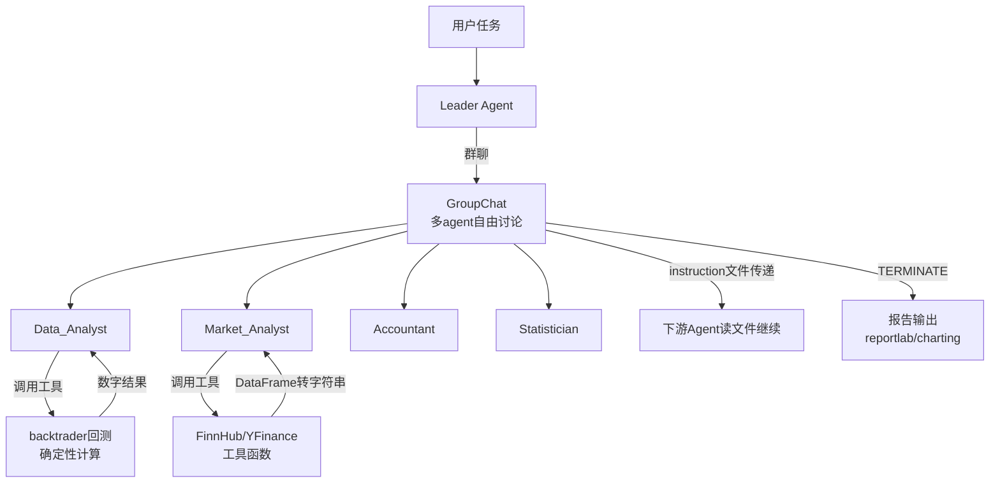

# FinRobot 源码深挖报告

> 调研日期：2026-08-12 ｜ 调研人：方块（总经理）
> 对象：AI4Finance-Foundation/FinRobot（AI4Finance 基金会，哥伦比亚大学背景）
> 方式：GitHub API 目录树 + 源码逐文件阅读（一手来源）

---

## 一、结论先行

1. **FinRobot 的技术路线与 TradingAgents 完全不同**：它基于 **AutoGen 群聊模式**（GroupChat + GroupChatManager），而 TradingAgents 基于 **LangGraph 显式状态图**。这两条路线正是当前金融 agent 的两大流派，**对比着看 = 框架选型的完整决策依据**。
2. **三个值得抄的设计**：① 工具函数全部用 `Annotated[str, "描述"]` 自描述类型注解——LLM 调参零摩擦；② `stringify_output` 统一把 DataFrame 等输出转字符串喂给 LLM；③ **agent 间长上下文用文件传递**（"instruction & resources saved to <path>" 触发下游读文件），绕开上下文窗口限制。
3. **「数字代码算」的实现方式确认**：backtrader 回测等确定性计算被封装成**工具函数**，LLM 只负责传参，计算完全由代码执行——这印证了 README 的核心铁律（Numbers are code-calculated, Narratives are LLM-assisted）。
4. **最轻量的入门方式**：`agent_builder_demo.py` 只有 30 行——用 AutoGen AgentBuilder 按任务描述**自动生成 agent 列表**，连角色都不用手写。想快速验证多 agent 效果，这是最快的路径。

---

## 二、架构全貌

```
FinRobot/
├── finrobot/
│   ├── agents/
│   │   ├── agent_library.py        # Agent 库：配置 dict 列表（name + profile + toolkits）
│   │   ├── workflow.py             # FinRobot(AssistantAgent) 类：封装 agent 创建（继承 AutoGen）
│   │   ├── prompts.py              # 系统提示词模板（leader/role）
│   │   └── utils.py                # 消息触发编排（文件传递、指令提取）
│   ├── data_source/                # 数据层（美股）：SEC filings / earnings calls / FMP / Finnhub / yfinance / reddit
│   │   ├── filings_src/            # SEC 文件解析（prepline_sec_filings，文档分节）
│   │   └── marker_sec_src/         # PDF→Markdown（Marker 引擎，并行）
│   ├── functional/                 # 功能工具层
│   │   ├── quantitative.py         # ★ backtrader 回测封装（确定性计算）
│   │   ├── analyzer.py             # 财务分析
│   │   ├── charting.py             # 图表
│   │   ├── rag.py / ragquery.py    # RAG 检索
│   │   ├── reportlab.py            # PDF 报告生成
│   │   ├── coding.py               # 代码读写工具
│   │   └── text.py
│   ├── toolkits.py                 # ★ 工具注册中心（register_function + stringify_output）
│   └── utils.py
├── experiments/                    # 实验：investment_group / multi_factor_agents / portfolio_optimization
├── agent_builder_demo.py           # ★ 30 行最小演示（AgentBuilder 自动建 agent）
└── finrobot_equity/                # 新桌面版（PydanticAI + FastAPI + Tauri，9 agent，30 确定性算子）
```

### 核心运作模式（mermaid 源，可编辑）



---

## 三、五个核心机制（源码级）

### 1. Agent 定义：配置 dict，不是类
`agent_library.py` 中每个 agent 就是一个 dict：
```python
{
    "name": "Market_Analyst",
    "profile": "As a Market Analyst, one must ... collect necessary financial information ...",
    "toolkits": [
        FinnHubUtils.get_company_profile,
        FinnHubUtils.get_company_news,
        FinnHubUtils.get_basic_financials,
        YFinanceUtils.get_stock_data,
    ],
}
```
- `profile` 即系统提示词（职责描述）
- `toolkits` 绑定该 agent 专属工具
- 角色可组合（通用角色：Data_Analyst/Programmer/Accountant/Statistician；金融角色：Market_Analyst/Financial_Analyst）

### 2. 工具注册三件套（toolkits.py）
- **`stringify_output` 装饰器**：所有工具返回值统一转字符串（DataFrame→`to_string()`），保证 LLM 永远读到文本
- **`register_toolkits`**：从配置列表注册（AutoGen `register_function`，caller 提需求 / executor 执行 分离）
- **`register_tookits_from_cls`**：把整个工具类的公开方法批量注册为工具

### 3. 确定性计算 = 工具函数（quantitative.py）
- `BackTraderUtils.back_test()`：backtrader 回测封装成工具函数，**所有参数带 `Annotated[str, "描述"]` 类型注解**——AutoGen function calling 直接据此生成参数 schema，LLM 只传参，代码算结果
- `DeployedCapitalAnalyzer(bt.Analyzer)`：自定义分析器（return_on_deployed_capital）
- 支持自定义策略/指标/sizer 的模块路径注入（`"my_module:TestStrategy"`）

### 4. 长上下文用文件传递（agents/utils.py）
- `instruction_trigger`：当某 agent 消息含 `"instruction & resources saved to <path>"` 时，触发下游 agent **读取该文件**作为指令继续执行
- `order_message`：正则 `\[pattern\]` 从消息中提取指令块注入下游
- > 启示：这是绕过上下文窗口的实用技巧——中间产物落盘，按需读取

### 5. 极简入门（agent_builder_demo.py，30 行）
```python
builder = AgentBuilder(config_file_or_env="OAI_CONFIG_LIST", ...)
agent_list, agent_configs = builder.build(building_task, llm_config, coding=True)
group_chat = autogen.GroupChat(agents=agent_list, messages=[], max_round=20)
manager = autogen.GroupChatManager(groupchat=group_chat, llm_config=...)
agent_list[0].initiate_chat(manager, message="Today is ..., predict next week's stock price for Nvidia ...")
```
- AgentBuilder 按任务描述自动生成角色列表（甚至不用自己定义角色！）
- 群聊 max_round=20 轮上限
- 已生成的 agent 配置可 save/load 复用

---

## 四、TradingAgents vs FinRobot：框架选型对比（核心决策表）

| 维度 | TradingAgents | FinRobot |
|------|---------------|----------|
| **编排框架** | LangGraph（显式状态图） | AutoGen（GroupChat 群聊） |
| **流程控制** | 固定流水线 + 条件边（辩论轮次可控） | 自由群聊 + 消息触发路由（TERMINATE 结束） |
| **角色** | 13 个固定金融角色（写死） | 配置化 agent 库 + AgentBuilder 自动构建 |
| **结构化输出** | Pydantic schema（仅 3 个决策角色） | 工具函数 Annotated schema（天然自描述） |
| **记忆** | 追加式 markdown 日志（TradingMemoryLog） | 文件传递上下文（无显式记忆模块） |
| **确定性计算** | 数据工具函数（无回测） | ★ backtrader 回测工具化 |
| **数据层** | Alpha Vantage / yfinance / FRED / Reddit / StockTwits | FMP / Finnhub / yfinance / SEC EDGAR（含 filings 解析） |
| **报告输出** | markdown 报告树 | HTML / PDF（reportlab）+ 图表 |
| **可解释性** | 决策日志 + 反思（Phase B） | 群聊记录全程可见 |
| **上手门槛** | 中（需理解图概念） | ★ 低（30 行 demo 可跑） |

**选型判断**：
- **要可控、要审计、流程固定** → TradingAgents 式（显式图，我们的公司 kanban 思维天然契合）
- **要快速验证、要灵活探索** → FinRobot 式（群聊 + 自动建 agent）
- 自研时两者可以融合：**图做骨架（可控），群聊做节点内部（灵活）**——这是我们最可能的方案

---

## 五、对我们自研的借鉴清单（补充上份报告）

| # | FinRobot 设计 | 借鉴方式 | 优先级 |
|---|---------------|----------|--------|
| 1 | `Annotated` 自描述工具参数 | 所有工具函数统一加类型注解（我们可用 Pydantic 等价实现） | ★★★ |
| 2 | `stringify_output` 统一输出 | DataFrame/数字结果一律转字符串再进 prompt | ★★★ |
| 3 | 文件传递长上下文 | 中间产物落盘（如 reports/），下游按路径读取 | ★★☆ |
| 4 | backtrader 回测工具化 | 我们已有 backtrader 平台，直接封装成 agent 工具 | ★★★ |
| 5 | 工具类批量注册 | `register_tookits_from_cls` 模式，少写样板代码 | ★★☆ |
| 6 | 配置 dict 定义 agent | 角色 = 配置（name+profile+toolkits），加角色不改代码 | ★★☆ |
| 7 | AgentBuilder 自动建角色 | 原型期快速验证多 agent 效果 | ★☆☆ |

---

## 六、局限与坑

1. **AutoGen 群聊的失控风险**：自由群聊轮次不可控（max_round 是硬上限，但 agent 可能绕圈），Token 消耗比图模式高——生产场景需要强路由约束。
2. **数据层全美股**：SEC EDGAR / FMP / Finnhub 全是美股，A股要全换（同 TradingAgents 问题）。
3. **无记忆模块**：FinRobot 靠群聊上下文 + 文件传递，跨会话记忆不如 TradingAgents 的日志方案。
4. **依赖较重**：AutoGen + backtrader + matplotlib + IPython（Jupyter 依赖），pip 安装链条长。
5. **OAI_CONFIG_LIST 硬编码**：demo 写死 OpenAI 模型，接 DeepSeek 需改配置（AutoGen 支持 OpenAI 兼容端点）。

---

## 七、参考资料（一手来源）

- FinRobot 源码：https://github.com/AI4Finance-Foundation/FinRobot （重点看 `finrobot/agents/agent_library.py`、`finrobot/toolkits.py`、`finrobot/functional/quantitative.py`、`agent_builder_demo.py`）
- 论文：arXiv:2405.14767（FinRobot）
- 相关：FinGPT（https://github.com/AI4Finance-Foundation/FinGPT）
