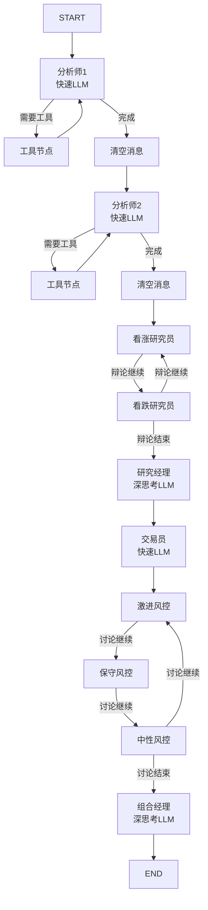

# TradingAgents 源码深挖报告

> 调研日期：2026-08-12 ｜ 调研人：方块（总经理）
> 对象：TauricResearch/TradingAgents（原版，GitHub 6.9万星）＋ hsliuping/TradingAgents-CN（中文增强版，3.1万星）
> 方式：GitHub API 目录树 + raw 源码逐文件阅读（一手来源，非二手解读）

---

## 一、结论先行

1. **TradingAgents 的架构骨架非常干净，是「可借鉴」的标杆**：160 个文件的 Python 包，核心只有 5 个目录（agents / graph / dataflows / llm_clients / reporting），LangGraph 状态机编排，没有重型框架依赖。
2. **最有价值的 4 个设计**：① 双 LLM 分层（深思考/快思考）；② 分析师「思考→工具→清空」循环；③ 辩论与风控的条件循环；④ 追加式 markdown 记忆日志（不是向量库）。
3. **CN 版 = 原版核心 + A股数据适配层 + 全栈壳（FastAPI + Vue3 + CLI）**，核心价值在 `china_market_analyst.py` 和三源数据适配（tushare/akshare/baostock）——这个适配思路我们可直接复用。
4. **注意**：CN 版 2032 个文件，全栈壳（app/、frontend/、Redis、MongoDB、选股系统）占了 90% 体积。我们自研时**只借鉴 tradingagents/ 核心 118 个文件的设计，不抄壳**。

---

## 二、原版架构全貌

```
TradingAgents/
├── tradingagents/
│   ├── agents/                    # 智能体层（13个角色）
│   │   ├── analysts/              # 4个分析师：fundamentals / market(技术面) / news / sentiment(+social_media)
│   │   ├── researchers/           # bull_researcher / bear_researcher（多空辩论）
│   │   ├── risk_mgmt/             # aggressive / conservative / neutral（风控三人组辩论）
│   │   ├── managers/              # research_manager / portfolio_manager（管理层）
│   │   ├── trader/                # 交易员（出交易方案）
│   │   ├── schemas.py             # Pydantic 结构化输出契约
│   │   └── utils/                 # 工具函数 + memory.py（记忆日志）
│   ├── graph/                     # LangGraph 编排层（核心）
│   │   ├── setup.py               # 建图（节点+边定义）
│   │   ├── conditional_logic.py   # 条件路由（辩论轮次控制）
│   │   ├── analyst_execution.py   # 分析师执行计划
│   │   ├── checkpointer.py        # 断点续跑
│   │   ├── propagation.py         # 决策传播
│   │   ├── reflection.py          # 反思（Phase B 复盘）
│   │   └── signal_processing.py   # 信号处理
│   ├── dataflows/                 # 数据层（美股：alpha_vantage / yfinance / fred / reddit / stocktwits / polymarket）
│   ├── llm_clients/               # 多模型适配（openai/anthropic/google/azure/bedrock + factory + model_catalog）
│   └── reporting.py               # 报告输出
```

### 核心流程图（mermaid 源，可编辑）



---

## 三、四个核心设计细节（源码级）

### 1. 双 LLM 分层（成本控制的关键）
`trading_graph.py` 初始化两个模型：
- **deep_thinking_llm**（深思考）：只给 Research Manager 和 Portfolio Manager 用——最终决策者
- **quick_thinking_llm**（快思考）：其余 11 个角色全用——分析、辩论、写报告

> 启示：预算敏感场景，让「贵模型只拍板，便宜模型干粗活」。我们自研同样适用（DeepSeek 也可以分 V3/R1 或不同 temperature）。

### 2. 分析师「思考→工具→清空」循环
`setup.py` 中每个分析师节点模式：
```
agent ⇄ tools（条件边：should_continue_xxx 判断是否还要调工具）
   ↓ 完成后
clear 节点（清空消息，防止上下文爆炸）
   ↓ 进入下一个分析师
```
- 分析师可配置：`selected_analysts=("market","social","news","fundamentals")`
- 每个分析师配独立工具节点（`tool_nodes[key]`）

### 3. 辩论与风控的条件循环
- **投资辩论**：Bull Researcher ⇄ Bear Researcher 循环，`should_continue_debate` 按 `max_debate_rounds` 控制轮次，路由表 `DEBATE_PATH_MAP` 全覆盖防止 LangGraph 崩溃（#1088 修复）
- **风控辩论**：Aggressive ⇄ Conservative ⇄ Neutral 三人循环，同理 `max_risk_discuss_rounds`
- 辩论状态 `InvestDebateState`：bull_history / bear_history / history / current_response / judge_decision / count

### 4. 记忆系统：追加式 markdown 日志（不是向量库！）
`memory.py` — `TradingMemoryLog`，设计非常朴素但实用：
- 追加式 markdown 文件，条目格式：`[日期 | ticker | 评级 | pending]` + DECISION + REFLECTION
- **两阶段**：Phase A 决策时写入（pending 标记，幂等防重）→ Phase B 复盘时 `update_with_outcome` 补结果
- **上下文注入**：`get_past_context(ticker, n_same=5, n_cross=3)` — 同股票最近 5 条决策 + 跨股票最近 3 条教训，拼成 prompt 上下文注入
- HTML 注释 `<!-- ENTRY_END -->` 作分隔符，杜绝 LLM 输出干扰解析

> 启示：记忆不一定要向量库。结构化文本日志 + 精准注入，简单、可审计、零依赖。我们自研完全可复制此模式。

### 5. 结构化输出的边界（schemas.py）
- **只有 3 个决策型角色用 Pydantic 结构化输出**：Research Manager（ResearchPlan）、Trader（TraderAction: Buy/Hold/Sell）、Portfolio Manager（PortfolioRating: 5级评级）
- 其余 agent 输出散文（人类可读，下游当上下文读）
- 空值合并：LLM 写 "N/A"/"none" 等占位符自动转 None（#1058 修复）

> 启示：结构化输出是「决策契约」，不是所有输出都要 JSON——自由文本分析 + 结构化决策，两头兼顾。

---

## 四、CN 版的 A 股适配方式（可复用的部分）

### 1. 新增 `china_market_analyst.py`（中国市场分析师）
- 多市场识别：`market_info['is_china'] / is_hk / is_us`
- A 股名称解析走统一接口 `get_china_stock_info_unified`，带两级降级方案（统一接口 → 数据源管理器 → 兜底"股票代码xxx"）
- 港股/美股有独立处理分支（美股内置常用公司名映射）

### 2. 数据源统一注册（constants/data_sources.py）
```
A股: tushare / akshare / baostock    （三源，按优先级降级）
美股: yfinance / finnhub / alpha_vantage / iex_cloud
专业: wind / choice（东财Choice）
缓存: MongoDB（最高优先级）
```
- 每个源有 adapter + sync worker + 限流测试（docs 里有 rate-limit 测试文档）
- tushare 有统一化迁移文档（token 优先级、初始化指南）

### 3. 其他增强（参考价值排序）
- `risk_manager.py`：管理层增加风险经理角色
- `chromadb_config.py`：向量记忆可选件（默认仍是 markdown 日志）
- `dataflows/cache/`：文件/DB/MongoDB 三级缓存
- 全栈壳（FastAPI + Vue3 + Redis + 选股 screening）——**不推荐抄**，与我们无关

---

## 五、对我们自研的借鉴清单

| # | 设计 | 借鉴方式 | 优先级 |
|---|------|----------|--------|
| 1 | 双 LLM（deep/quick） | 决策角色用深思考，分析角色用快思考 | ★★★ |
| 2 | 分析师「思考→工具→清空」循环 | 控制上下文长度，工具调用收敛 | ★★★ |
| 3 | 多空辩论 + 风控三人组 | 我们做交易决策路线时加辩论层 | ★★★ |
| 4 | 追加式 markdown 记忆日志 | 直接复刻（同股5条+跨股3条注入） | ★★★ |
| 5 | 结构化输出只给决策角色 | Pydantic 契约，散文+结构化混合 | ★★☆ |
| 6 | 数据源注册表 + 降级链 | 我们已有 akshare/baostock/东财经验，做 adapter 抽象 | ★★☆ |
| 7 | 断点续跑（checkpointer） | 长流程中断恢复，LangGraph 自带 | ★☆☆（早期可不要） |
| 8 | 中国市场分析师多级降级 | 名称解析/数据缺失的兜底模式 | ★★☆ |

## 六、局限与坑（必须知道）

1. **回测收益不可信**：原版论文的收益数字饱受质疑，The Alpha Illusion（arXiv:2605.16895）指出 LLM agent 回测 alpha 系统性失真——**我们只借鉴流程，不迷信收益**。
2. **美股数据源依赖重**：原版数据层全是 Alpha Vantage / yfinance / Reddit / StockTwits，A 股要全部替换（CN 版的做法是加 adapter 层，不动核心）。
3. **CN 版仓库臃肿**：2032 个文件，全栈壳占了 90%，且是社区魔改版（0 星 fork 很多，慎 clone 大杂烩仓库）。
4. **LLM 成本**：每只股票跑一轮完整流程 = 13 个角色 × 多轮调用，用 DeepSeek 也要按 token 预算设计（双 LLM + 轮次上限 max_debate_rounds 是控制手段）。
5. **延迟**：一次完整分析几分钟起步（多轮 LLM 调用），不适合盘中实时决策，适合盘后研究。

---

## 七、参考资料（一手来源）

- 原版源码：https://github.com/TauricResearch/TradingAgents （重点看 `tradingagents/graph/setup.py`、`tradingagents/graph/trading_graph.py`、`tradingagents/agents/utils/memory.py`、`tradingagents/agents/schemas.py`）
- 中文增强版：https://github.com/hsliuping/TradingAgents-CN （重点看 `tradingagents/agents/analysts/china_market_analyst.py`、`tradingagents/constants/data_sources.py`、`tradingagents/config/tushare_config.py`）
- 论文：arXiv:2412.20138（TradingAgents）｜ arXiv:2405.14767（FinRobot）
- 警示：arXiv:2605.16895（The Alpha Illusion）
