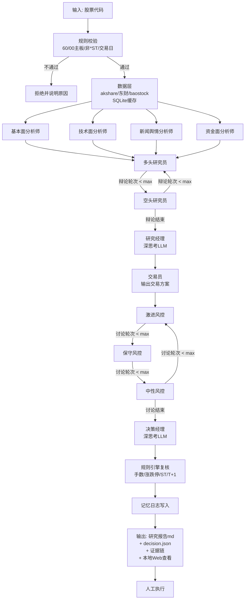

# 交易决策金融 Agent（路线 B）Spec

> 版本：v1.1 ｜ 作者：PM ｜ 日期：2026-08-12
> 状态：待 Architect 评审 ｜ 依赖调研：`research/` 目录下 4 份报告（金融agent调研报告 / TradingAgents源码深挖 / FinRobot源码深挖 / A股金融agent开源项目盘点）
> Changelog：v1.1（2026-08-12）Y2 拍板为 B：交付形态 = CLI + 本地 Web 展示；Y1=A（不含回测）、Y3=A（全中文）确认

---

## 目标

为「交易决策金融 Agent」（路线 B）定义第一版（MVP）完整需求：用户输入一只 A 股代码，系统以多智能体流水线完成个股研究 + 多空辩论，输出**中文研究报告 + Buy/Hold/Sell 买卖信号 + 仓位建议 + 证据链**（CLI + 本地 Web 展示，边界见 8.4），辅助用户人工下单（不自动交易）。

一句话：**让 9000 元实盘散户，用一套可审计的多智能体系统，把「研究 → 辩论 → 决策」的过程变成带证据的报告和可执行信号。**

---

## 一、背景与产品定位

### 1.1 用户画像

- 广东海洋大学学生，已有 A 股实盘账户（约 9000 元，仅沪深主板 60/00 代码）
- 已有 stock-lab 项目：东财 push2 / 新浪 / akshare / baostock 数据拉取经验
- 已有 backtrader 量化平台经验
- 2026-08-04 开始实盘，**未满 6 个月，QMT/PTrade 条件不满足** → 现阶段只能「信号 + 人工执行」

### 1.2 硬约束（不可违反）

| # | 约束 | 说明 |
|---|------|------|
| H1 | 只用 DeepSeek | 全部 LLM 调用走 DeepSeek API（deepseek-chat / deepseek-reasoner 或等价，由 Architect 定） |
| H2 | 不自动下单 | 系统只输出信号 + 仓位建议 + 证据链，人工执行；不接任何券商 API |
| H3 | 从零自研 | 可借鉴 TradingAgents / FinRobot / A股开源项目**设计**，不抄代码，不引入重型框架 |
| H4 | 中文报告 | 面向用户的全部产出为中文 |
| H5 | A股规则合规 | T+1、涨跌停、100 股整数倍、ST 风险、交易日历，全部硬编码进规则引擎 |
| H6 | 数字代码算 | 所有财务/技术/仓位数字由确定性代码计算，LLM 只做推理与叙述（FinRobot 铁律） |
| H7 | 收益不作部署证据 | 遵循 The Alpha Illusion 警示：MVP 不以「回测收益」为验收依据，agent 定位为分析助手 |

### 1.3 产品定位

- **定位**：盘后个股研究 + 交易决策助手（日线级别，非盘中实时）
- **不是**：自动交易机器人、选股器、投顾问答、收益承诺
- **对标参考**：TradingAgents 的交易决策链路（分析师 → 多空辩论 → 交易员 → 风控 → 组合经理），FinRobot 的「确定性计算 + LLM 叙述」分层，A股生态的「7 分析师 + SQLite 缓存」模式

### 1.4 MVP 范围（第一版做什么 / 不做什么）

**做（MVP 内）：**

1. 单只股票盘后分析：输入 6 位代码 → 输出完整研究报告 + 信号 + 仓位建议 + 证据链
2. 4 名 A 股分析师（基本面 / 技术面 / 新闻舆情 / 资金面）+ 多空研究员辩论 + 研究经理综合 + 交易员方案 + 风控三人组评估 + 决策经理拍板（共 12 角色）
3. 数据层：akshare / 东财 push2 / baostock + SQLite 缓存（TTL 策略、自动建表/补列/去重）
4. 确定性计算工具集：技术指标、涨跌停价、手数/仓位、ST 过滤、T+1/交易日判断
5. 追加式 markdown 记忆日志（决策写入；格式预留复盘字段，复盘命令 P2）
6. CLI 运行 + markdown 报告 + 结构化决策 JSON + 本地 Web 展示（localhost，查看最近一次分析，边界见 8.4）
7. 免责声明与「不构成投资建议」提示

**不做（明确排除出 MVP，列入 P2）：**

- ❌ 自动下单 / 券商 API 对接（QMT 未满足，硬约束 H2）
- ❌ 多股票批量分析、持仓组合管理（MVP 单只逐次）
- ❌ 收益回测与绩效归因（P2，且必须做前视偏差防护；H7）
- ❌ 盘中实时盯盘 / 分钟级信号（MVP 盘后日线）
- ❌ 政策 / 游资 / 解禁 分析师（P2，新闻舆情分析师先覆盖政策新闻）
- ❌ 向量记忆 / RAG（P2，MVP 用 markdown 日志即可）
- ❌ 港股、美股、创业板/科创板/北交所（用户只交易沪深主板 60/00）

---

## 二、系统流程（可编辑源：下方 mermaid 代码块）



**流程说明：**

1. **输入校验**：代码格式（6 位数字）、板块（60xxxx 沪主板 / 000-003 深主板）、*ST 拒绝、ST 允许但风控禁 Buy
2. **数据就绪**：数据层按缓存 TTL 拉取全部所需数据，任一数据源失败走降级链，全部失败则终止并报缺失清单
3. **分析师并行**：4 名分析师各自「思考 → 调工具 → 清空上下文」循环（借鉴 TradingAgents 的分析师循环，控制 token）
4. **多空辩论**：多头 ↔ 空头循环，默认最多 2 轮（可配置 `--debate-rounds`）
5. **决策链**：研究经理（深思考）综合 → 交易员出方案 → 风控三人组辩论 → 决策经理（深思考）拍板
6. **规则复核**：决策经理输出后，确定性规则引擎强制复核（信号与 ST/涨跌停/资金约束冲突则降级修正并记录）
7. **记忆与输出**：决策写入 markdown 记忆日志 → 生成报告 + decision.json + 证据链 → 本地 Web 服务可查看最近一次分析（见 8.4）

---

## 三、输入输出定义

### 3.1 输入

| 参数 | 类型 | 必填 | 默认 | 说明 |
|------|------|------|------|------|
| `--code` | str（6 位数字） | 是 | - | 股票代码，如 600519 |
| `--period` | str | 否 | `day` | MVP 仅支持日线 `day`（架构预留周线参数，P2） |
| `--capital` | float（元） | 否 | 9000 | 可用资金，用于手数/仓位计算 |
| `--position-status` | str | 否 | `none` | `none`（空仓）/ `holding`（已持仓，可带成本价） |
| `--debate-rounds` | int | 否 | 2 | 多空辩论轮次上限（1-3） |
| `--risk-rounds` | int | 否 | 2 | 风控讨论轮次上限（1-3） |

**输入校验规则（确定性，代码实现）：**

- 非 6 位数字 → 拒绝，提示格式
- 非沪深主板（排除 300/688/8xx/4xx/北交所）→ 拒绝，提示「MVP 仅支持沪深主板 60/00」
- 证券简称含 `*ST` → 拒绝并提示退市风险
- 证券简称含 `ST`（非 *ST）→ 允许分析，但规则引擎强制信号 ≠ Buy
- 当日为非交易日 → 提示使用最近交易日数据

### 3.2 输出

**产出文件（写入 `output/<代码>/<日期>/` 目录）：**

| 文件 | 内容 |
|------|------|
| `report.md` | 完整中文研究报告（结构见 3.3） |
| `decision.json` | 结构化决策契约（见 3.4），供人工执行与程序消费 |
| `evidence_chain.json` | 证据链：每个关键结论 → 数据源 + 字段 + 时间 + 计算函数 + 值 |
| `run.log` | 运行日志：每步耗时、token 消耗、缓存命中、降级记录（可审计） |

**decision.json 契约（Pydantic schema 校验，MVP 100% 通过）：**

```json
{
  "code": "600519",
  "date": "2026-08-12",
  "signal": "Buy | Hold | Sell",
  "position_tier": 0 | 1 | 2 | 3,
  "position_pct": 0.0 | 0.25 | 0.50 | 0.75,
  "suggested_shares": 0,
  "suggested_price_range": ["", ""],
  "stop_loss": "",
  "target": "",
  "confidence": "high | medium | low",
  "executability": {"limit_up": false, "limit_down": false, "t_plus1_note": ""},
  "rationale": "",
  "risk_flags": [],
  "evidence_refs": []
}
```

### 3.3 信号与仓位定义

**信号（signal）：**

| 信号 | 含义 | 空仓者 | 持仓者 |
|------|------|--------|--------|
| `Buy` | 建议买入 | 按仓位档位建仓 | 可加仓至目标档位 |
| `Hold` | 观望/持有 | 不建仓 | 维持现仓 |
| `Sell` | 建议卖出 | 不介入 | 减仓/清仓，含触发条件与止损位 |

**仓位档位（position_tier，离散）：**

| 档位 | 仓位 % | 场景 |
|------|--------|------|
| 0 | 0% | 观望/清仓 |
| 1 | 25% | 轻仓试探 |
| 2 | 50% | 标准仓 |
| 3 | 75% | 重仓（MVP 上限，留 25% 现金） |

- **手数规则**：建议股数 = `floor(capital × position_pct / (现价 × 100)) × 100`，确定性函数计算；现价过高导致 0 手 → 档位降级为 0 并提示「资金不足一手」
- **可执行性标注**：当日涨停 → Buy 标记 `limit_up=true` 提示可能无法买入；跌停 → Sell 标记 `limit_down=true` 提示可能无法卖出；所有买卖均附 T+1 说明（T 日买入，T+1 日方可卖出）

### 3.4 研究报告结构（report.md，7 部分）

1. **摘要**：信号、仓位、目标价/止损位、核心逻辑 3 条
2. **分析师分项报告**：基本面 / 技术面 / 新闻舆情 / 资金面 各一节，每节含结论 + 数据依据
3. **多空辩论纪要**：多空双方论点交锋记录（谁说了什么，最终谁占优）
4. **研究经理综合研判**：从辩论中提炼的核心矛盾与投资逻辑
5. **交易方案与风控评估**：交易员方案 + 激进/保守/中性风控意见
6. **决策经理结论**：最终信号 + 仓位档位 + 理由 + 风险提示
7. **证据链附录**：关键数字出处（数据源、时间、计算函数、值）+ 免责声明

---

## 四、角色清单（12 角色）

> 角色 = 配置（name + profile 职责描述 + tools 绑定），借鉴 FinRobot 配置 dict 模式；具体 prompt 由 Coder/Architect 编写，本 Spec 给出职责与输出契约。
> 双 LLM 分层：**深思考**（deep，仅 2 个决策角色：研究经理、决策经理）与 **快思考**（quick，其余 10 个角色）——借鉴 TradingAgents 双 LLM 设计，控制成本。具体 DeepSeek 模型映射由 Architect 定。

| # | 角色 | 类型 | LLM 层 | 职责 | 工具/数据访问 |
|---|------|------|--------|------|---------------|
| 1 | 基本面分析师 fundamentals | 分析师 | quick | 财报趋势、盈利能力、估值水平、分红、ST 风险标记 | 财务指标、估值、ST 状态 |
| 2 | 技术面分析师 technical | 分析师 | quick | 趋势、均线、MACD/RSI、支撑压力位、量价关系 | K线、技术指标计算工具 |
| 3 | 新闻舆情分析师 news | 分析师 | quick | 近期新闻、公告、政策事件、舆情情绪 | 新闻、公告 |
| 4 | 资金面分析师 capital_flow | 分析师 | quick | 主力资金净流入、大单动向、（可选）融资融券 | 主力资金流、融资融券 |
| 5 | 多头研究员 bull | 研究员 | quick | 收集多方论据，形成看涨论点，回应空头 | 4 份分析师报告（只读） |
| 6 | 空头研究员 bear | 研究员 | quick | 收集空方论据，形成看跌论点，回应多头 | 4 份分析师报告（只读） |
| 7 | 研究经理 research_manager | 决策 | **deep** | 综合辩论，判断核心矛盾，输出投资研判计划 | 辩论纪要（只读） |
| 8 | 交易员 trader | 决策 | quick | 将研判转为可执行交易方案（价格区间/仓位/止损） | 研判计划（只读）+ 手数计算工具 |
| 9 | 激进风控 risk_aggressive | 风控 | quick | 从进攻视角评估方案可行性 | 交易方案 + 规则引擎输出 |
| 10 | 保守风控 risk_conservative | 风控 | quick | 从防守视角评估风险与回撤 | 交易方案 + 规则引擎输出 |
| 11 | 中性风控 risk_neutral | 风控 | quick | 平衡攻守，给出中立评估 | 交易方案 + 规则引擎输出 |
| 12 | 决策经理 portfolio_manager | 决策 | **deep** | 综合全部输入，拍板最终信号 + 仓位档位 | 全部上游输出（只读） |

**结构化输出边界（借鉴 TradingAgents schemas.py 设计）：**

- 仅 3 个决策节点使用 Pydantic 结构化输出：研究经理（研判要点结构）、交易员（TraderAction）、决策经理（decision.json）
- 分析师/研究员/风控输出**自由文本**（人类可读，下游当上下文读取），风控三人组可给「通过/有条件/否决」倾向标记

---

## 五、数据需求清单

> 数据源策略：akshare 为主力（已有经验）、东财 push2 补充实时/资金、baostock 补充历史财务与回测数据；全部走统一 adapter + 降级链（参照 TradingAgents-CN 数据源注册表思路）。

### 5.1 数据源与字段

| # | 数据 | 主源 | 备源 | 关键字段 | 缓存 TTL | 供谁用 |
|---|------|------|------|----------|----------|--------|
| D1 | 日K线（前复权） | akshare | 东财 push2 / baostock | date, open, high, low, close, volume, amount, pct_chg | 1 天（盘后） | 技术面 |
| D2 | 实时行情快照 | 东财 push2 | akshare | price, pct_chg, 涨停价, 跌停价, 量比 | 15 分钟 | 规则引擎/可执行性 |
| D3 | 主力资金流 | 东财 push2 | akshare | 近 5/10/20 日主力净流入、超大单/大单/中单/小单 | 15 分钟 | 资金面 |
| D4 | 融资融券 | akshare | - | 融资余额、融券余额、日变化 | 1 天 | 资金面（可选） |
| D5 | 财务指标 | baostock | akshare | ROE、营收/净利同比、毛利率、负债率、EPS | 30 天（季报） | 基本面 |
| D6 | 估值 | akshare | baostock | PE、PB、股息率、总市值 | 1 天 | 基本面 |
| D7 | 新闻 | akshare | 东财 | 标题、发布时间、来源、正文摘要 | 12 小时 | 新闻舆情 |
| D8 | 公告 | 东财 | akshare | 标题、日期、类型 | 12 小时 | 新闻舆情 |
| D9 | ST/风险标记 | akshare | 东财 | 证券简称（ST/*ST 判断）、上市状态 | 1 天 | 输入校验 |
| D10 | 交易日历 | akshare | 硬编码兜底 | 交易日列表（含节假日休市） | 365 天 | 规则引擎/T+1 |

**降级链**：akshare 失败 → 东财 push2 → 新浪/腾讯 → baostock（历史类）；全部失败 → 流程终止，报告「数据缺失清单」。

### 5.2 SQLite 缓存策略（借鉴 A_Share_investment_Agent 的 akshare_cache 模式）

- 缓存文件：`data/akshare_cache.db`（SQLite，单文件）
- 表结构：列名与数据源保持一致 + 额外 `cache_time` 字段
- 机制：统一 TTL 策略、自动建表、自动补列、去重（主键 = 代码 + 日期/时间粒度）
- 命中规则：未过期直接读缓存（日志标记 `cache hit`）；过期重新拉取并覆盖
- 目的：解决 akshare 接口慢 + 限频问题（调研报告明确指出的痛点）

---

## 六、确定性计算清单（数字代码算，LLM 不算）

> 全部实现为纯 Python 工具函数，LLM 只传参、读结果（FinRobot 铁律 + Annotated 自描述参数模式）。

| # | 计算 | 输入 | 输出 | 用途 |
|---|------|------|------|------|
| C1 | 技术指标 | 日K线 | MA5/10/20/60、MACD、RSI、布林带、量均线、近期高低点 | 技术面 |
| C2 | 涨跌停价 | 昨收、ST状态 | 涨停价 = round(昨收×1.10, 2)，ST = ×1.05 | 可执行性 |
| C3 | 手数/仓位 | 资金、现价、档位 | `floor(资金×pct/(价×100))×100` 股 | 仓位建议 |
| C4 | 资金流聚合 | 主力资金流 | 近 5/20 日净流入汇总、方向判断 | 资金面 |
| C5 | 估值引用 | 估值源 | PE/PB/股息率直接取数（LLM 不计算） | 基本面 |
| C6 | T+1/交易日 | 交易日历 | T+1 生效日、下一交易日 | 规则引擎 |
| C7 | 板块校验 | 代码 | 60/00 主板 / 其他 | 输入校验 |
| C8 | 规则复核 | decision.json | 冲突检测与降级修正（ST 禁 Buy、涨停禁 Buy 可执行性等） | 最终把关 |

**规则引擎（C2/C6/C7/C8 的强制规则，代码硬编码）：**

- R1：只接受沪深主板 60xxxx / 000-003xxxx
- R2：*ST 拒绝；ST 禁止 Buy 信号（若决策经理输出 Buy，规则引擎降级为 Hold 并在 run.log 记录「规则修正」）
- R3：买入股数必须 100 股整数倍；资金不足 1 手 → 仓位档位降为 0
- R4：涨停标记不可买入、跌停标记不可卖出（信号保留但可执行性标注）
- R5：所有交易建议必须附 T+1 说明
- R6：非交易日自动使用最近交易日

---

## 七、记忆设计（MVP：追加式 markdown 日志）

借鉴 TradingAgents `TradingMemoryLog`（朴素、可审计、零依赖）：

- 文件：`memory/decisions.md`，条目格式：`[日期 | 代码 | 信号 | 仓位 | pending]` + DECISION（决策理由摘要）
- **Phase A（决策时）**：写入 pending 标记（幂等防重：同日同代码不重复写）
- **Phase B（复盘）**：MVP 仅预留 `update_with_outcome` 字段格式（结果/盈亏/复盘反思），复盘 CLI 命令列入 P2
- **上下文注入**：下一次分析同股票时注入最近 5 条历史决策 + 最近 3 条跨股票教训（`get_past_context`），作为研究经理/决策经理的附加上下文
- HTML 注释分隔符防 LLM 输出干扰解析（同 TradingAgents 做法）

---

## 八、技术方案边界

> 本 Spec 只给**功能需求与硬约束**；具体架构（框架选型、目录结构、接口设计、模型映射）由 Architect 负责，但必须满足以下边界。

### 8.1 硬性技术约束

1. **LLM**：仅 DeepSeek API；双 LLM 分层（deep/quick）必须实现，映射方案（如 deepseek-reasoner vs deepseek-chat，或同模型不同 temperature/上下文裁剪）由 Architect 决定
2. **编排**：借鉴 LangGraph 图状态机思想，但**不强制引入 LangGraph**——决策流固定，允许自研轻量 orchestrator（推荐，符合 H3）；Architect 定夺，需给出理由
3. **确定性计算**：一律纯 Python 函数 + Pydantic 参数校验，禁止 LLM 直接输出数字参与计算
4. **结构化输出**：决策节点用 Pydantic schema 校验，输出非法自动重试（最多 2 次）
5. **数据层**：统一 adapter 接口 + 降级链 + SQLite 缓存（见第五节）
6. **可审计**：全程日志（run.log 含每步耗时、token、缓存命中、降级、规则修正）
7. **成本控制**：单次运行目标 ≤ ¥0.5（DeepSeek 按量计费）；控制手段 = 双 LLM 分层 + 分析师「思考→工具→清空」循环 + 辩论轮次上限

### 8.2 非功能需求

| 维度 | 目标 |
|------|------|
| 单次运行时长 | ≤ 5 分钟（2026-08-13 老板拍板放宽，原 ≤3 分钟：LLM 推理链 170-190s 为本质开销，盘后场景可接受，架构优化列 P2） |
| 成本 | ≤ ¥0.5/次（默认参数） |
| 失败处理 | 数据源降级；LLM 调用重试 2 次；任一环节失败可定位（run.log） |
| 可解释性 | 报告含证据链；decision.json 含 evidence_refs |
| 合规 | 报告末尾强制免责声明；不提供任何自动下单能力 |

### 8.3 明确不做（技术侧）

- 不引入重型框架全家桶（Redis/MongoDB/向量库；Web 层允许轻量方案，选型由 Architect 定，见 8.4）
- 不做并发批量分析（单进程顺序执行即可，P2 再考虑）
- 不做多用户 / 公网部署（Web 展示仅 localhost 本地单机，见 8.4）

### 8.4 Web 展示层边界（Y2 拍板 = B，2026-08-12）

- **定位**：CLI 分析完成后，本地 Web 服务展示**最近一次**分析结果，仅 localhost 单机使用
- **展示内容**：report.md 渲染 / decision.json 信号与仓位卡片 / 证据链表格 / 记忆日志（memory/decisions.md）查看
- **不做**：用户系统 / 登录鉴权、多股票管理、历史分析列表管理（P2）、公网部署
- **技术选型**：由 Architect 定；候选（轻量优先，二选一即可，MVP 不引入前端框架）：FastAPI + 简单前端（Jinja2/静态 HTML）或 streamlit

---

## 九、MVP 验收标准（可验证）

> 定义：**MVP 完成 = 以下 9 项全部通过**。验收以「新鲜执行结果」为准（验证铁律）。

- [ ] **A1 端到端跑通**：`python -m finagent.cli analyze --code <真实代码> --capital 9000` 退出码 0，≤ 5 分钟（2026-08-13 拍板放宽），产出 report.md + decision.json + evidence_chain.json + run.log 四个文件
- [ ] **A2 输出契约**：decision.json 通过 Pydantic schema 校验（signal ∈ {Buy,Hold,Sell}；position_tier ∈ {0,1,2,3}；必填字段非空）——连续跑 3 只不同代码 100% 通过
- [ ] **A3 规则合规**：输入 300xxx/688xxx/*ST 代码被拒绝并给出原因；ST 代码输出信号 ≠ Buy；建议股数为 100 整数倍；涨停/跌停可执行性正确标注；含 T+1 说明——用边界样例验证 100% 通过
- [ ] **A4 数字可追溯**：报告正文 ≥ 10 个关键数字带证据链引用；抽查其中 5 个数字，能在代码工具输出（C1-C6）中复现一致
- [ ] **A5 缓存生效**：同一代码连续跑 2 次，第 2 次 run.log 显示未过期数据全部 `cache hit`，无重复网络请求
- [ ] **A6 记忆写入**：每次决策后 memory/decisions.md 出现对应条目（含日期/代码/信号/仓位/pending 标记）；同代码再次分析时上下文注入历史条目
- [ ] **A7 成本达标**：单次运行 token 消耗折算 ≤ ¥0.5（run.log 记录），3 次运行取平均
- [ ] **A8 报告完整**：report.md 含 7 个部分（摘要/分析师/辩论纪要/综合研判/交易方案与风控/决策结论/证据链附录+免责声明）

- [ ] **A9 Web 展示可用**：本地启动 Web 服务（仅 localhost），浏览器可查看最近一次分析报告（report.md 渲染 / decision.json 信号与仓位卡片 / 证据链表格 / 记忆日志查看；无用户系统、无多股票管理）

---

## 十、任务拆解建议（依赖与并行）

> 拆解为 7 组 + 集成，供 Architect/PM 排期。**并行原则：契约先行（本 Spec 已定义字段与接口边界），无依赖的组并行开发。**

```
组A 数据层（先行）
 ├─ A1 SQLite 缓存层（TTL/建表/补列/去重）
 ├─ A2.1 akshare adapter（K线/财务/新闻/交易日历/ST标记）
 ├─ A2.2 东财 push2 adapter（实时行情/主力资金流/公告）
 ├─ A2.3 baostock adapter（历史财务/复权）
 └─ A3 降级链 + 统一数据接口   ← A2.x 各源可并行，A3 依赖 A2.x

组B 确定性计算（可与 A 并行，契约见第六节）
 ├─ B1 技术指标计算（C1）
 ├─ B2 规则引擎（C2/C6/C7/C8：涨跌停/T+1/板块/ST/交易日历）
 └─ B3 仓位手数计算（C3/C4/C5）

组C 角色层（可与 A/B 并行，依赖数据字段契约）
 ├─ C1 角色配置 + 12 份 profile prompt（4分析师/2研究员/经理/交易员/3风控/PM）
 ├─ C2 结构化输出 schema（研究经理/交易员/决策经理）
 └─ C3 记忆日志模块（Phase A 写入 + 上下文注入）   ← 独立，可随时并行

组D 编排层（依赖 A/B/C 接口）
 └─ D1 orchestrator（流程状态机：校验→数据→分析师→辩论→决策链→规则复核→输出）

组E 输出层（可与 A/B/C 并行）
 ├─ E1 report.md 模板（7 部分）
 ├─ E2 decision.json 序列化
 └─ E3 run.log 审计日志

组F 集成与验收（依赖全部）
 ├─ F1 端到端联调（A1-A9 逐项跑）
 ├─ F2 边界样例测试集（非主板/ST/*ST/涨停/跌停/资金不足一手/数据缺失降级）
 └─ F3 3 只真实股票试运行（含缓存二次命中验证）

组G Web 展示层（依赖 E1/E2 输出格式，可与 F 并行）
 ├─ G1 本地 Web 服务（仅 localhost 单机）
 ├─ G2 报告渲染页面：report.md 渲染 / decision.json 卡片 / 证据链表格 / 记忆日志查看
 └─ G3 与输出目录对接（读取最近一次分析；技术选型由 Architect 定：FastAPI+简单前端 或 streamlit 候选）
```

**关键路径**：A → D → F；B/C/E/G 并行；C 只需等待 A 的字段契约（本 Spec 已定，可先行）；G 依赖 E1/E2 输出格式（本 Spec 已定，可先行）。
**建议并行分配**：A2.x 各源 = 并行；B = 独立 1 人；C1 prompt 编写 = 独立 1 人（可拆 4 分析师/决策链两组）；E = 独立 1 人；G = 独立 1 人（Web 层，选型由 Architect 定）。
**P2 队列**（不阻塞 MVP）：复盘命令、政策/游资/解禁分析师、回测模块（前视偏差防护）、批量分析、向量记忆、Web 多股票管理/历史列表。

---

## 十一、🟢 老板已拍板项（2026-08-12，不在 Spec 内自行假设）

| # | 议题 | 选项 | 建议 | 拍板 |
|---|------|------|------|------|
| Y1 | **MVP 是否包含回测验证模块** | A. 不含（MVP 只做信号+人工执行，回测放 P2 且必须带前视偏差防护）<br>B. 含简易规则回测（复用已有 backtrader，成本可控，但仅作流程验证，不作收益证据） | **A**（The Alpha Illusion 警示：回测 alpha 不可作为部署证据；MVP 目标是把决策流程跑通，不是证明收益） | ✅ **A**（2026-08-12） |
| Y2 | **交付形态** | A. CLI + markdown 报告（最轻，与 stock-lab 工作流一致）<br>B. CLI + 本地 Web 展示（报告可视化，工作量 +2~3 天） | **B**（老板拍板：本地 Web 展示不改变决策链路，价值直观；范围见 8.4） | ✅ **B**（2026-08-12） |
| Y3 | **内部辩论语言** | A. 全中文（DeepSeek 中文推理强，报告与辩论同语言便于证据链审计）<br>B. 辩论英文、报告中文（A股开源项目 astock 做法，英文保推理质量的假设） | **A**（DeepSeek 中文推理质量不弱于英文；同语言链路审计成本更低） | ✅ **A**（2026-08-12） |

> ✅ 已拍板 2026-08-12：Y1=A（MVP 不含回测）、Y2=B（CLI + 本地 Web 展示）、Y3=A（全中文）。按此执行，不再等待。

---

## 十二、风险与缓解

| 风险 | 影响 | 缓解 |
|------|------|------|
| LLM 输出幻觉数字 | 决策错误 | H6 铁律：数字全部代码计算；evidence_chain.json 强校验 |
| 数据源限频/反爬 | 流程卡住 | SQLite 缓存 + 降级链 + 失败终止报缺失清单 |
| 辩论失控/上下文爆炸 | token 超预算 | 轮次上限 + 分析师「思考→工具→清空」循环 + run.log 成本监控 |
| 用户误把信号当投资建议 | 亏损/纠纷 | 免责声明 + 「辅助决策、人工执行」定位 + 风控规则（ST 禁 Buy、75% 仓位上限） |
| 回测收益误导 | 过度自信 | H7：MVP 不做回测验收；P2 回测强制前视偏差防护 |
| 决策不可解释 | 用户不信任 | 报告 7 部分 + 证据链 + 记忆日志全量留痕 |

---

## 十三、协作说明

- **产出物**：本文件（spec.md）→ 交接 Architect 出技术方案；随后按第十节拆 ticket 给 Coder/Algorithm
- **前置依赖**：4 份调研报告（research/ 目录）；Y1-Y3 已拍板（2026-08-12：Y1=A、Y2=B、Y3=A）
- **对接方**：Architect（技术边界、双 LLM 映射、编排选型、Web 展示选型）→ Coder（数据层/缓存/工具/CLI）→ Algorithm（指标计算/规则引擎）→ QA（A1-A9 验收）
- **数据经验来源**：stock-lab 项目（东财 push2/新浪/akshare/baostock）；backtrader 平台（P2 回测复用）
- **参考设计（不抄代码）**：TradingAgents 决策链路与记忆日志、FinRobot 确定性计算分层、A_Share_investment_Agent SQLite 缓存、TradingAgents-astock A股角色扩展
